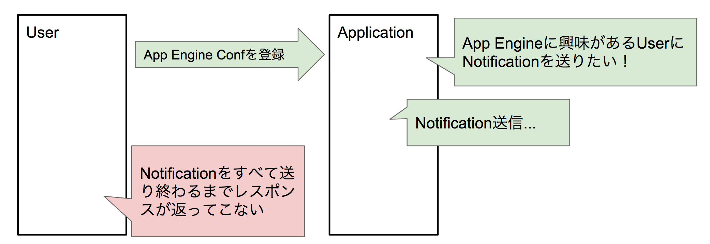
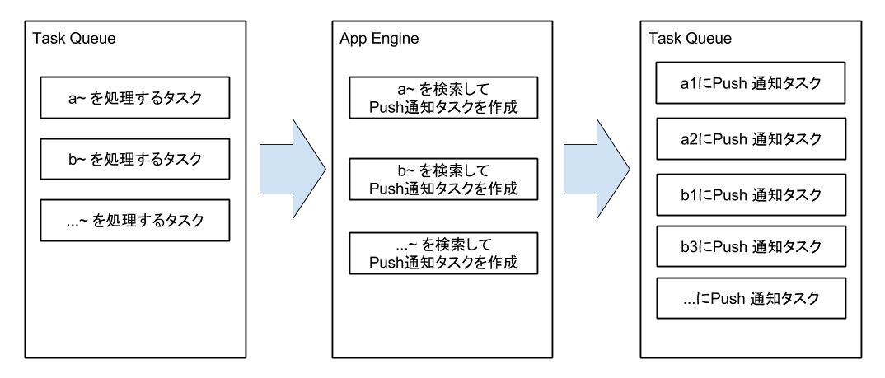

# App Engine 使いはアプリケーションを作る時に何を考えているのか？

tag:["google-app-engine"]

ここではApp Engine使いがアプリケーションを設計する時に何を考えているのかを話します。
App EngineはWebアプリケーションを作るためのPaaSのサービスですが、apacheなどを利用した伝統的なWebアプリケーションとは大きく設計が異なります。

## 非同期と分散

App Engineで最も重要なのは非同期と分散に主体を置いて考えることです。
App Engineは強力な1台のサーバが稼働しているサービスではなく、1つ1つは小さなContainerです。
また、1リクエストを処理するのに制限時間があるため、その時間内で処理を終わらせる必要があります。
そのために、必要なのが非同期と分散です。
1つの大きなタスクを1リクエストで処理しようとするのではなく、タスクを分割し、複数のサーバで並列に実行させることで、パフォーマンスを向上させることができます。

## Task Queue

タスクを分割し、並列に実行させるために大きな役割を果たすのがTask Queueです。
Task QueueはApp Engineにビルトインされているサービスなので、App Engineを使っていればすぐに利用することができます。

たとえば、イベントを登録して参加者を募るようなサービスを例に考えてみます。
イベントオーナーがイベントを登録した時に、イベントに興味があるユーザにPush通知を送るような機能を作るとします。
イベントを登録するリクエストで、Push通知を送るようにしてしまうと、対象ユーザがたくさんいた場合に、時間がかかってしまい、イベントを登録しようとした人はずっと待っている必要があります。
さらにPush通知を送信している途中でエラーがアプリケーションが終了してしまうと、中途半端にPush通知を送った状態になってしまう上に、イベントを登録しようとした人から見ると、イベント登録が失敗したかのように見えてしまいます。

このような場合、イベントのPush通知を送信する処理は非同期で行います。
イベントを登録するリクエストでは、イベントの登録とイベントのPush通知を送信するタスクをTask Queueに追加する処理のみを行います。

これで、イベントを登録する時の処理時間が長い問題は解決したので、次にPush通知を送信するタスクについて考えていきます。

### タスクの分散

Push通知を送る処理には大きく分けて、次の2つの処理が存在します。

* 対象ユーザの検索
* Push通知の送信

2つの処理はある程度並列に行うことができます。
対象ユーザの検索を先に行うことは確定ですが、対象ユーザを全員見つけてから、Push通知の送信を行う必要はありません。
見つかった人から徐々に送っていけばよいです。
ということで、まずは対象ユーザの検索とPush通知の送信を分けていきます。
この場合もやっぱり間にはTask Queueを利用します。
対象ユーザが1000人見つかるごとにTask Queueに入れていいくような感じにします。

これで1000人ずつ並列に処理することができるようになりました。
しかし、まだ問題があります。
対象ユーザがたくさんいて、検索に時間がかかるケースです。
対象ユーザが100万人いる場合、秒間1000人を見つけて送っていったとすると、1000秒かかります。
もう少し最初にPush通知を送ったユーザと、最後にPush通知を送ったユーザの間隔を狭めていきたいです。
実現するために、対象ユーザの検索を並列化します。
やり方は色々ありますが、簡単なのは対象ユーザをグループ分けして考えて、検索する方法です。
たとえば、ユーザIDの先頭の数文字で分割するとか、サービス登録日付で分割するなどです。
そうすれば、重複することなく、対象ユーザの検索を行うことができます。

### Service 分割

Task Queueを利用する時に、Taskを追加するServiceとTaskを処理するServiceは同一である必要はありません。
今回のイベント登録の例だと、イベントを登録するリクエストはエンドユーザから来るリクエストになります。
エンドユーザからのリクエストはほとんどの場合、default serviceで受け取ります。
では、Push通知を送るリクエストはどうするのか？ですが、default service以外にすることが多いです。
それは、エンドユーザからのリクエストと、Push通知送信リクエストの優先度が違うからです。
Push通知送信リクエストは数秒遅延しても問題ありませんが、エンドユーザからのリクエストは迅速にレスポンスを返す必要があります。
Push通知送信リクエストを、エンドユーザからのリクエストを受け取るserviceと同じserviceに送ってしまうと、エンドユーザからのリクエストを阻害してしまう可能性があります。
また、サーバのスペックもservice毎に設定していくので、すべてのリクエストが同じserviceに来ていると、小さいけど早く返す必要があるリクエストや、大きいけどゆっくりやってもよいリクエストが混ざってしまって、スペックの設定が難しくなります。
そのため、少なくともエンドユーザから来るリクエストとTask Queueから来るリクエストを受け取るserviceは分割しておいた方がよいです。
アプリケーションの機能によっては、更にserivceを分割していきます。
Push通知送信は小さなタスクをたくさん処理する必要があるので、小さなサーバをたくさん作るような設定に、CSVファイルをごそっと処理する必要な場合はメモリがたくさん必要なので、大きなサーバになるように設定するという感じです。

## リトライと冪等性

Task Queueを利用してタスクを分割するメリットとして、タスクが失敗しても、リトライしてくれます。
クラウドの世界ではH/Wは日々壊れていくものなので、自分のアプリケーションが動いているH/Wが壊れたタイミングで処理されていた内容は失われてしまいます。
そのため、リトライ戦略はとても重要です。
Task Queueはデフォルトでリトライ機能を持っているため、Task Queueに追加さえすれば、成功するまで無限にリトライされます。
この時、1つのタスクが多すぎるとリトライ範囲が大きくなってしまうので、タスクはある程度小さな単位にしておきます。
また、リトライで重要なのが冪等性です。
H/Wの故障でアプリケーションが終了した場合、どこまで処理が進んでいたのか？どこでエラーが発生したのか？というのは分かりません。
そのため、リトライ時はタスクをもう一度最初から実行することになります。
その場合、処理の冪等性が非常に重要になります。
冪等性を担保する方法はタスクの内容によって変わってきますが、よくあるのはKeyの値を事前に決めておき、同じ箇所を上書きすることです。
そうすれば、何度実行しても同じデータが上書きされるだけなので、問題ありません。

## 外部のAPIを実行する

外部のAPIを実行する場合もなるべくTask Queueに逃がすことを考えます。
App Engineはリクエストを受け取るのは得意ですが、リクエストを送るのはそんなに得意ではありません。
App Engineのサーバそのものは外部にリクエストを送信する機能を持っておらず、URL Fetch API, Socket APIといったビルトインされているAPIに頼ることになります。
ビルトインされているとは言え、物理的には離れている状態でRPCでやりとりするため、多少のオーバーヘッドが存在します。
そのため、なるべくなら、エンドユーザからのリクエストの中で同期的に行うのではなく、Task Queueで非同期で行った方が、パフォーマンスがよくなるし、エラーの回数も減ります。
ただ、Task Queueを利用した時に注意点として、 `常にリトライされる可能性がある` があります。
これは1回目の実行で正常終了したとしても、リトライされる可能性があることを指します。
自分のデータベースへのアクセスであれば、冪等になるようにすればよいですが、外部のAPIだと難しいケースがあります。
特にPOST系のAPIを実行する場合は、データが重複される可能性があります。
相手のAPIがそのようなことを考慮している場合は、処理を冪等に保つための仕組みが入っていることがあるので、それを利用します。
たとえば、BigQueryのStreaming Insert APIはInsertIDをクライアントが指定でき、InsertIDが重複しているデータが一定時間以内に来た場合、2回目以降は無視するという仕組みが入っています。
このような仕組みが入っていれば、タスクに自分でIDを付与し、リトライされても同じIDでデータを送信するようにしてやるだけで冪等にすることができます。