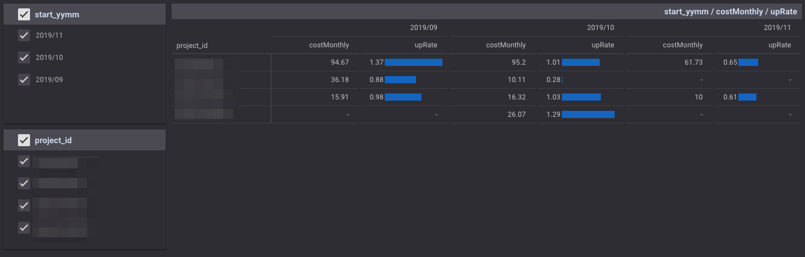

# GCP Billingの前月比を見る

tag:["google-bigquery", "billing"]

[BigQueryにExportしたGCPのBilling Data](https://cloud.google.com/billing/docs/how-to/export-data-bigquery) から、GCP Projectごとに前月比を得るためのサンプルです。

DataStudioで前月比のグラフなどを表示するための元データを作ることができます。



```
SELECT
  *
FROM (
  SELECT
    project_id,
    start_yymm,
    costMonthly,
    SAFE_DIVIDE(costMonthly,
      (LAG(costMonthly) OVER(PARTITION BY project_id ORDER BY start_yymm))) AS upRate
  FROM (
    SELECT
      project_id,
      FORMAT_DATE("%Y/%m", DATE(start_time, "Asia/Tokyo")) AS start_yymm,
      SUM(cost) costMonthly
    FROM (
      SELECT
        usage_start_time AS start_time,
        project.id AS project_id,
        cost + IFNULL(credit.amount,
          0) AS cost
      FROM
        `{Your Billing Table}`
      LEFT OUTER JOIN
        UNNEST(credits) AS credit)
    WHERE
      DATE_DIFF(CURRENT_DATE(), DATE(start_time, "Asia/Tokyo"), MONTH) < 4 # 今月も含んで、過去3ヶ月
      AND project_id != "null"
    GROUP BY
      project_id,
      start_yymm ) )
WHERE
  costMonthly > 10
  AND upRate IS NOT NULL
  AND costMonthly / upRate > 10 # 前月も$10を超えている
```

上記の例では、今月も含めて過去3ヶ月分のデータを取得しています。
前月比を計算する時に、元の金額が小さい場合、前月比が大きくなってしまい、ノイジーなので、月額が一定金額を超えているもののみを対象とするようになっています。
上記のケースでは、USDで計算されているものなので、月額が$10を超えているものを対象としています。
この部分は費用感に合わせて調整してください。

App EngineやCompute Engineなどのサービスごとに前月比を見たい場合は、project_idをserviceに変えればできます。