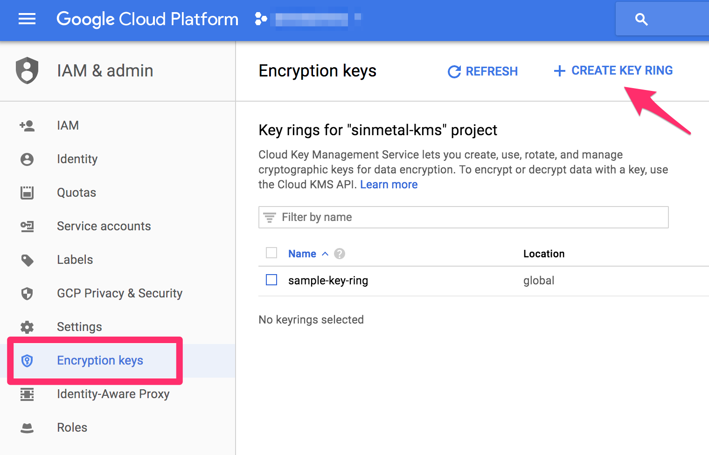
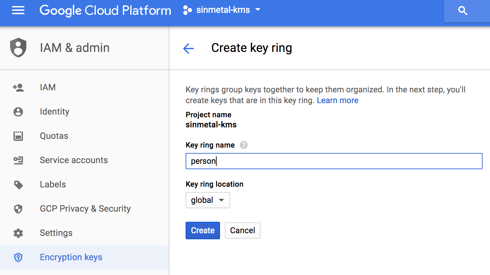
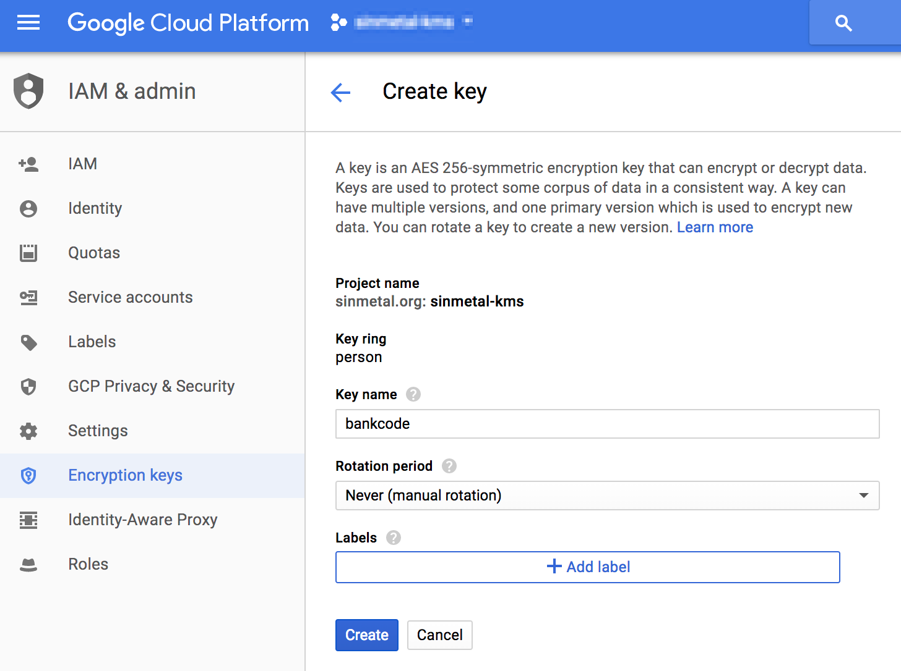

# Cloud KMS Introduction

tag["google-cloud-kms"]

[Cloud KMS](https://cloud.google.com/kms/) は暗号化を行うためのサービスです。
詳細は公式ドキュメントを読むのがおすすめですが、この記事では公式ドキュメントを読む前に、ざっくり把握して公式ドキュメントを読む時にすんなり理解できる前提知識を記します。

Cloud KMSは、APIで暗号化したいテキストを送信すると、暗号化して返してくれ、復号化したい場合は暗号化したテキストを送れば、復号化して返してくれるというシンプルなサービスです。
便利な点は暗号化のためのKeyをCloud KMS側で管理してくれる点です。
暗号化を行う場合、Keyをどのように管理するかは悩ましい問題ですが、Cloud KMSはそれを担ってくれます。

## Cloud KMSのResource

### KeyRing

KeyRingは暗号化のためのKeyをグルーピングするための存在です。

### CryptKey

CryptKeyは暗号化のためのKeyです。
いずれか1つのKeyRingの下にひも付きます。

### KeyRing, CryptKeyの範囲

1つのGCP Projectの中にKeyRing, CryptKeyは複数作成できます。
IAMもKeyRing, CryptKeyそれぞれ設定することができます。
KeyRing, CryptKeyを分ける動機は、役割ごとにまとめておく場合や、権限の差、セキュリティポリシーの差などです。
例えば、ユーザの情報を暗号化する時に、住所と銀行口座番号があるとします。
住所と銀行口座番号はセキュリティポリシーが違うと判断した場合は、CryptKeyを分けておくことになります。

#### Example

* KeyRing : Person
* CryptKey : Addr, BankCode

これはあくまで1つの例なので、自分のアプリケーションの要件に合わせて、KeyRing, CryptKeyを設計すればOKです。

## IAMとAudit Log

Cloud KMSを利用する場合、IAMの設定は少し考える必要があります。
アプリケーションと同じGCP ProjectでCloud KMSを利用した場合、ProjectのOwnerの権限を持つユーザはCloud KMSが利用できます。
GCPではProjectのOwnerが複数存在することが多いため、暗号化復号化可能なユーザが複数人いる状態になります。
Cloud KMSで暗号化するデータはProjectのOwnerであっても通常見ることはできないデータであることが多いため、これだと権限が広すぎます。
そのため、Cloud KMSを利用する専用のGCP Projectを作成し、管理するようにします。
そうすれば、Cloud KMSを利用できるユーザを絞ることがやりやすくなります。

また、Cloud KMSはAudit Logの機能もあるので、Audit LogをBigQueryに出力し、不審なアクセスが無いかを監視する。
更にリアルタイムに見たい場合は、Audit LogをCloud Pub/Subに流し、Cloud Functions, Cloud Dataflowなどでリアルタイムにモニタリングするなども行えます。

* [Using Cloud Audit Logging with Cloud KMS](https://cloud.google.com/kms/docs/separation-of-duties)
* [Separation of duties](https://cloud.google.com/kms/docs/separation-of-duties)

## 試してみる

すべてAPIで行うこともできますが、よくやるパターンとして、KeyRing, CryptKeyをCloud Consoleで作成して、暗号化復号化をプログラムから実行してみます。

### KeyRingの作成

Cloud KMSはIAM&Adminのメニューの中にEncryption keysという名前で存在しています。
最初は空っぽなので、 `CREATE KEY RING` からKeyRingを生成します。



Key ring nameとKey ring locationを入力します。
Key ring locationは基本的にはglobalで問題ありません。



### CryptKeyの作成

KeyRingができたら、その下にCryptKeyを作成します。
Rotation periodはお試しで作る場合は `Never (manual rotation)` を指定すれば、自動rotation無しの状態にできます。




### 暗号化復号化の実行

KeyRing, CryptKeyが作成できれば、暗号化復号化が行えるようになります。

#### gcloudで試す

gcloud kms commandを利用して暗号化復号化を行うことができます。

##### fileを指定して暗号化復号化する

```
# 暗号化
gcloud kms encrypt --key sample-key --keyring sample-key-ring --location global --plaintext-file=/home/metal_tie/plaintext.txt --ciphertext-file=/home/metal_tie/ciphertext.txt

# 復号化
gcloud kms decrypt --key sample-key --keyring sample-key-ring --location global --plaintext-file=/home/metal_tie/plaintext-out.txt --ciphertext-file=/home/metal_tie/ciphertext.txt
```

##### パイプで渡して暗号化復号化する

```
# 暗号化
echo "hoge" | gcloud kms encrypt --key sample-key --keyring sample-key-ring --location global --plaintext-file=- --ciphertext-file=- | base64 | tr -d '\n'

# 復号化
echo "CiQA7W/KKBz1E+m/keOHnR+Wcfmf2ukBkwxzmjNuWYI9w4PjlkESMwBGfWCM0rsIMhJ3+1ePKYkasmfn6OKjmXkqzzUNCnCdMuZ3n6siwuQ2/pXq3Ia326O9Lg==" | base64 -d | gcloud kms decrypt --key sample-key --keyring sample-key-ring --location global --plaintext-file=- --ciphertext-file=-
```

#### Goで試す

[API Client Library](https://developers.google.com/api-client-library/) を利用して、利用するCryptKeyとBASE64文字列を送るだけです。

``` kms.go
// Encrypt is Cloud KMSでEncryptを行う
func (service *KMSService) Encrypt(cryptKey CryptKey, plaintext string) (ciphertext string, cryptoKey string, err error) {
	response, err := service.S.Projects.Locations.KeyRings.CryptoKeys.Encrypt(cryptKey.Name(), &cloudkms.EncryptRequest{
		Plaintext: base64.StdEncoding.EncodeToString([]byte(plaintext)),
	}).Do()
	if err != nil {
		return "", "", errors.Wrapf(err, "encrypt: failed to encrypt. CryptoKey=%s", cryptKey.Name())
	}

	return response.Ciphertext, response.Name, nil
}

// Decrypt is Cloud KMSでEncryptされた文字列をDecryptする
func (service *KMSService) Decrypt(cryptKey CryptKey, ciphertext string) (plaintext string, err error) {
	response, err := service.S.Projects.Locations.KeyRings.CryptoKeys.Decrypt(cryptKey.Name(), &cloudkms.DecryptRequest{
		Ciphertext: ciphertext,
	}).Do()
	if err != nil {
		return "", errors.Wrapf(err, "decrypt: failed to decrypt. CryptoKey=%s", cryptKey.Name())
	}

	t, err := base64.StdEncoding.DecodeString(response.Plaintext)
	if err != nil {
		return "", errors.Wrap(err, "decrypt: failed base64 decode")
	}
	return string(t), nil
}
```

以下は実際にAPIを実行したものです。サンプルコードは [kms_playground](https://github.com/sinmetal/kms_playground) にあります。
Cloud KMSの便利な点として、同じCryptKeyで同じ文字列を暗号化しても、違う文字列が生成されるようになっています。
また、暗号化した時のレスポンスとして、暗号化に利用したCryptKeyが返ってきますが、渡したCryptKey + CryptKeyVersionがくっついて返ってきています。
CryptKeyは内部でVersionを持っており、Versionを変更することができるようになっています。
復号化する時は引数にVersionを含める必要はなく、CryptKeyの指定だけで大丈夫なので、どのVersionで暗号化したのか必ずしも保持しておく必要はありません。
ただし、CryptKeyのVersionをDestroyする時は、そのVersionで暗号化されたデータの再暗号化が必要になるケースがあります。
その場合、どのデータがどのVersionで暗号化されたのかが分かった方が最小限の再暗号化で済むというのがあります。
最小限の再暗号化を考慮せず、全データを新しいVersionで再暗号するという方針の場合、Versionは保持する必要がありません。
詳しくは次の [CryptKeyのRotationと状態](https://github.com/gcpug/nouhau/tree/feature/cloudkms/introduction/cloudkms/poem/introduction#cryptkey%E3%81%AErotation%E3%81%A8%E7%8A%B6%E6%85%8B) を確認してください。

``` 暗号化
go run *.go --project=sinmetal-kms --cmd=encrypt --text=HelloWorld
CipherText=CiQA7W/KKJF9AiNnV2upAQDJgWDcfxROYj7mvjvmPAr9OaMAKk4SMwAONeK/QabFca9zqpHPW2Q8dg/JofWARG4jaF5/vDGyxzyq9iW1JvVaTgLBwe2OAt8pDw==
CryptoKey=projects/sinmetal-kms/locations/global/keyRings/sample-key-ring/cryptoKeys/sample-key/cryptoKeyVersions/1
```

``` 復号化
go run *.go --project=sinmetal-kms --cmd=decrypt --text=CiQA7W/KKJF9AiNnV2upAQDJgWDcfxROYj7mvjvmPAr9OaMAKk4SMwAONeK/QabFca9zqpHPW2Q8dg/JofWARG4jaF5/vDGyxzyq9iW1JvVaTgLBwe2OAt8pDw==
PlainText=HelloWorld
```

``` 同じCryptKey, 同じ文字列でも暗号化後の文字列は違うものになる
go run *.go --project=sinmetal-kms --cmd=encrypt --text=HelloWorld
CipherText=CiQA7W/KKJykvEYg1a3kT8BgUWFc7QF+Trm78je9qOqsCrHahGASMwAONeK/KRl3wrchvGI7129qVjDigUNUxCl4yI0YfX6aUeAdNqKeAkprCYTI5omgizRTnA==
CryptoKey=projects/sinmetal-kms/locations/global/keyRings/sample-key-ring/cryptoKeys/sample-key/cryptoKeyVersions/1

go run *.go --project=sinmetal-kms --cmd=encrypt --text=HelloWorld
CipherText=CiQA7W/KKESNf32yt9Ek9T1G5ISXfmJRjZMbq162Jbh/IaXt6zISMwAONeK/9tqnD56shHCNrd9op5OTWHf2mqxIkiNw+TbjKzPG3l8QqdwtCO5dnOGFsZ7+tg==
CryptoKey=projects/sinmetal-kms/locations/global/keyRings/sample-key-ring/cryptoKeys/sample-key/cryptoKeyVersions/1
```

## CryptKeyのRotationと状態

### Rotation

https://cloud.google.com/kms/docs/key-rotation

CryptKeyはVersionを複数持つことができ、1つのVersionをPrimaryとします。
暗号化に利用するのはPrimaryに指定されているVersionです。
PrimaryになっていないVersionで暗号化されたデータも問題なく復号化できます。
Verionは手動で増やすこともできますし、スケジュールを指定して自動でRotationさせることもできます。
KeyをRotateさせるのは、セキュリティポリシーで90日ごとにKeyを変える必要がある場合や、暗号化したデータのライフサイクルに合わせてKeyをRotationさせたいみたいな時に利用します。

### CryptKeyの状態

https://cloud.google.com/kms/docs/key-states

CryptKeyはVersionごとに状態を持ちます。
状態はENABLED, DISABLED, DESTROY_SCHEDULED, DESTROYEDの4つです。
暗号化に利用できるのはENABLEDの状態のもの、復号化に利用できるのはENABLED, DISABLED, DESTROY_SCHEDULEDのものです。
DESTROYEDされたCryptKeyで暗号化されたデータは復号化できなくなるので、期限付きで利用するトークンのようなものは期限ごとにVersionを区切ってDESTROYしていくといったことができます。
DESTROYED予定のVersionで暗号化したデータを今後も使う予定がある場合は、DESTROYED前にデータを復号化し、新しいVersionで暗号化しなおして保持する必要があるので注意してください。 [Re-encrypting data](https://cloud.google.com/kms/docs/re-encrypt-data)

## 料金

Cloud KMSの料金は以下の2つです。詳細は [Cloud KMS Pricing](https://cloud.google.com/kms/pricing)

### アクティブなCryptKey Version

* DESTROYEDではないKeyのVersionの数 * 月額 0.06 ドル

大量にCryptKeyを作成したり、Rotationを凄まじく細かくしない限りは、そんなに大きな料金にはならないはずです。

###  暗号化または復号化

* 0.03 ドル / 10,000 オペレーション

暗号化と復号化は同じ料金です。オペレーションごとに料金が発生するので、同じデータに対して短い時間に複数回アクセスする場合などは、自前で復号化されたデータをキャッシュすれば、安くはできます。ただし、メモリ上に平文のデータが存在する時間が長くなるので、セキュリティとのトレードオフで設計してください。

## 注意点

KeyRing, CryptKey, CryptKeyVersionは作成すると削除することはできません。料金としては、すべてDESTROYEDにしてしまえば、無料になりますが、テストなどで作りすぎると、ややこしくなるので、気を付けてください。

以下、該当箇所の公式ドキュメントの原文 [Destroying and restoring key versions](https://cloud.google.com/kms/docs/destroy-restore)

```
Note: To prevent resource name collisions, key ring and key resources CANNOT be deleted. Key versions also cannot be deleted, but key version material can be destroyed so that the resources can no longer be used. Key rings and keys do not have billable costs or quota limitations, so their continued existence does not impact costs or production limits.
```
