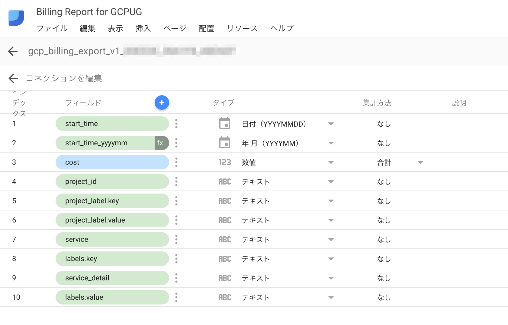

# Google Cloud Platform Billingのレポートサンプル

tag:["google-data-studio"]

[Export Billing Data to BigQuery](https://cloud.google.com/billing/docs/how-to/export-data-bigquery) を利用すると、GCPのBilling情報をBigQueryに出力できます。
そのまま見てもいいですが、やっぱりグラフになってたほうが傾向とかが分かりやすいね！ってことで、DataStudioでさくっと可視化してみました！
DataStudioの使い方は [BigQueryにエクスポートしたGCPの課金データを可視化してみる](https://qiita.com/tora470/items/0a3879426d6acc9f0d14) を見るのがよいです。

## Report Example

できあがったらレポートは https://datastudio.google.com/reporting/1Q_IdZmNIV9v4sIkw6-FLrOTMRZuWtbdy/page/PLgL にあります。
データコネクタは、Export Billing Data to BigQueryで出力されたv1のtableをそのまま利用しています。

コネクションの項目は月毎のグラフを表示するために、 `YYYYMM` 形式の日付を追加しています。start_timeを複製して、タイプを `YYYYMM` にしているだけです。

