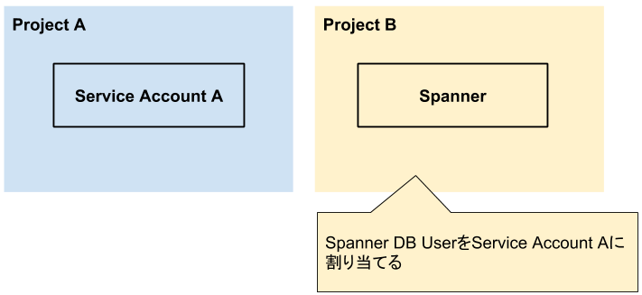
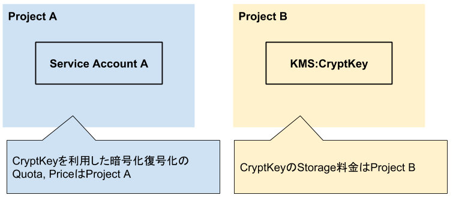

# GCPのAccountと認証、そしてRole

tag["google-cloud-platform"]

GCPのAPIを実行するためのAccountと認証、そしてRoleについて解説します。

## Accountの種類

AccountはUser AccountとService Accountの二種類があります。

### User Account

Google Accountの `example@gmail.com` やG Suiteの `hoge@gcpug.jp` が該当する人間用のAccount

### Service Account

Google App Engine, Google Compute EngineなどApplicationのためのAccount。
GCPのProjectに紐付く形で作成できる。
App Engine用の `gcpug@appspot.gserviceaccount.com` や、 Compute Engine用の `{project number}-compute@developer.gserviceaccount.com` のように最初から存在しているものがいくつかある。
自分で新しく作ることもできるので、オンプレミスの環境からCloud StorageにFileをUploadするための、Service Accountを作成したりすることもできる。

## 認証

### Google Cloud SDK

Google Cloud SDKでの認証は [公式ドキュメント](https://cloud.google.com/sdk/docs/authorizing) の通りで、そんなに難しいことはありません。

`gcloud` , `bq` , `gsutil` などを利用する時は主に [gcloud auth login](https://cloud.google.com/sdk/gcloud/reference/auth/login) を使います。
`gcloud auth login` を実行するとブラウザが起動するので、利用するGoogle Accountを選んで完了です。
現在、ログインしているAccountの確認は `gcloud config list` , 認証情報の取り消しは [gcloud auth revoke [ACCOUNT]](https://cloud.google.com/sdk/gcloud/reference/auth/revoke) で行います。
複数のAccountを利用している場合は、 `gcloud auth list` で認証済みのAccountの一覧が確認でき、 `gcloud config set account [ACCOUNT]` でActiveなAccountを切り替えることができます。

`gcloud` , `bq` , `gsutil` を使う時に、Service Accountを利用したいケースがあります。
ファイルの作成者をService Accountにしたい場合や、一部のリソースはService Accountでしか作れないものがあります。
そんな時に利用するのが [gcloud auth activate-service-account](https://cloud.google.com/sdk/gcloud/reference/auth/activate-service-account) です。
Service Accountは `key.json` を生成できるので、認証状態をそのService Accountに設定できます。

### Application

自分で作成したApplicationからGCPのAPIを実行することはよくあります。
Cloud StorageにFileをUploadしたり、BigQueryにQueryを実行したりと、様々です。
Applicationを開発する場合、Localでの開発とProductionとで、認証の方法が異なることがあるので、少しややこしいです。

#### Production

Production環境では基本的にDefaultで設定されているService Accountを利用します。
App EngineやCloud Buildなどは最初からService Accountを持っているので、必要に応じてそのService AccountにRoleを追加します。

##### Compute Engine

Compute EngineをBeseにするProductは歴史的経緯もあり、少し複雑になっています。
DefaultでService Accountを持っていますが、 `gcloud compute instances create` のオプションに `--scopes` があり、InstanceごとにCloud StorageやDatastoreなどのProductが使えるかどうかを設定するようになっています。
しかし、このやり方は現在はあまり推奨されていません。
Compute Engineリリース当初はIAMのRoleとしては、OWNER, EDITOR, VIEWERという3つの大きなRoleしかなかったので、Instanceごとに細かく設定できるようになっていたのですが、現在はIAMが細かく設定できるようになったので、不便なだけになっています。

現在、推奨されているのは `gcloud compute instances create` のオプションとして、 `--service-account` を指定して、独自のService Accountを設定することです。
`--service-account` を設定する場合は `--scopes` を設定できず、設定されたService AccountのRoleに従います。

Kubernetes Engineでも同じように `--scopes` は非推奨になっていて、 `gcloud container clusters create` で `--service-account` を利用して、独自のService Accountを設定するのが推奨されている。 refs [#66](https://github.com/gcpug/nouhau/issues/66)

#### Local

作成しているApplicationをLocalで動かす時の設定で最も簡単な方法は [gcloud auth application-default login](https://cloud.google.com/sdk/gcloud/reference/auth/application-default/login) を利用することです。
これを実行するとブラウザが起動し、指定したUser Accountで認証した状態になります。
Service Accountを利用したい場合は `--client-id-file` オプションに `key.json` をpathを指定します。

現在、どのAccountで認証しているか？は `$HOME/.config/gcloud/application_default_credentials.json` の中を見れば、なんとなく分かるのですが、User Accountだと分かりづらいので、どのAccountで認証しているか分からなくなったら、一度 [gcloud auth application-default revoke](https://cloud.google.com/sdk/gcloud/reference/auth/application-default/revoke) でrevokeして認証し直すのが無難です。

### 認証情報の探し方

GCP APIをApplicationから利用する場合、主な方法として2つの方法がある。
[API Client Library]() を利用する場合と [Cloud Client Library]() を利用する方法だ。
それぞれ利用時の認証情報の指定の仕方が少し異なる。
API Client Libraryの場合は `google.DefaultClient` を実行する。
Cloud Client Libraryの場合は、特に気にせず、Clientを作る。

以下は [公式ドキュメントのサンプル](https://cloud.google.com/docs/authentication/production#providing_credentials_to_your_application)

```
// implicit uses Application Default Credentials to authenticate.
func implicit() {
        ctx := context.Background()

        // For API packages whose import path is starting with "cloud.google.com/go",
        // such as cloud.google.com/go/storage in this case, if there are no credentials
        // provided, the client library will look for credentials in the environment.
        storageClient, err := storage.NewClient(ctx)
        if err != nil {
                log.Fatal(err)
        }

        it := storageClient.Buckets(ctx, "project-id")
        for {
                bucketAttrs, err := it.Next()
                if err == iterator.Done {
                        break
                }
                if err != nil {
                        log.Fatal(err)
                }
                fmt.Println(bucketAttrs.Name)
        }

        // For packages whose import path is starting with "google.golang.org/api",
        // such as google.golang.org/api/cloudkms/v1, use the
        // golang.org/x/oauth2/google package as shown below.
        oauthClient, err := google.DefaultClient(ctx, cloudkms.CloudPlatformScope)
        if err != nil {
                log.Fatal(err)
        }

        kmsService, err := cloudkms.New(oauthClient)
        if err != nil {
                log.Fatal(err)
        }

        _ = kmsService
}
```

この場合、Application Default Credentialを探すようになっている。
探す順番は以下の通り。

* $GOOGLE_APPLICATION_CREDENTIALS が設定されていれば、そこで示された `key.json` を読み込む
* `$HOME/.config/gcloud/application_default_credentials.json` があるかを調べる。(Windowsの場合は `$APPDATA\gcloud\application_default_credentials.json` を探す)
* Default Service Accountを探す (App Engine, Compute EngineなどLocal以外の場合)

Goの場合は [findDefaultCredentials](https://github.com/golang/oauth2/blob/d2e6202438beef2727060aa7cabdd924d92ebfd9/google/default.go#L43:6) で行っている。

上記の流れで探すので、 `gcloud auth application-default login` を実行するのが面倒な場合は $GOOGLE_APPLICATION_CREDENTIALS に `key.json` を指定するのが楽な方法である。

## Role

GCPのIAMはResourceに対してのRoleが設定されていれば操作することができる。
Projectが異なっていても可能で、Project AのCompute Engineから、Project BのCloud Spannerにアクセスする場合、Project BのIAMにProject AのCompute EngineのService AccountをSpannerを利用できるようにした権限で設定すればよい。



```
gcloud projects add-iam-policy-binding \
      'project B' \
      --member='serviceAccount:spanner@projectA.iam.gserviceaccount.com' \
      --role='roles/spanner.databaseUser'
```

Accountは基本的にそのAccountを利用するProjectで持っているResourceで、各Resourceにアクセスする場合は、そのAccountにRoleを設定していけばよい。

### QuotaとPrice

Accountを設定する時に1つ気を付けなければならないのが、QuotaとPriceです。
GCPのQuotaとPriceはちょいちょいややこしいところがあって、複数のProjectにResourceがあるとどのProjectのQuotaとPriceが消費されるのか、分かりづらいところがある。
例えば、Google Cloud KMSを利用する時に、CryptKeyを作成すると、CryptKeyの料金自体はCryptKeyが存在するProjectにかかる。
分かりづらいのが、CryptKeyを利用して暗号化復号化を行った時で、Service Accountが所属しているProjectにかかる。
なので、Service AccountとCryptKeyが別のGCP Projectにある場合、以下の図のようになる。



2 Projectで、どちらも自分の持ち物のProjectであれば、そこまで気にする必要はないが、Projectがたくさんあったり、他の人のProjectがあると、QuotaとPriceがどこにかかってほしいかを考える必要がある。
