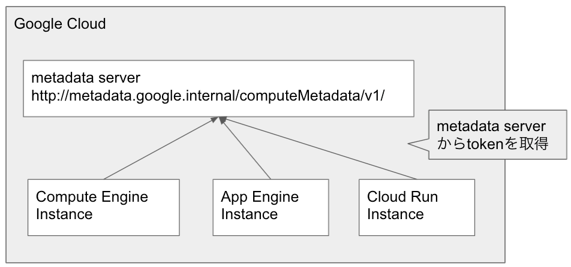
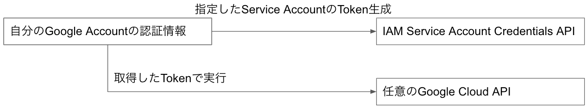

# Service Accountの運用について

tag["security"]

Service Accountの運用については [公式ドキュメント](https://cloud.google.com/iam/docs/best-practices-for-using-and-managing-service-accounts?hl=en) があるので、まずはこれを読んでもらいたい。
このページでは公式ドキュメントの内容を踏まえて、もう少し具体的な運用について書いていく。

## Service Accountの使い分け

Service Accountはその名前の通り、Accountなので、自分が何者なのかを示すために利用する。
自分で新たに作成することもできるし、最初から用意されているService Accountもいくつかある。
ProductはたいていなんらかのService Accountがアタッチされているので、何も考えずに動かすとそのService Accountが使われる。
defaultでアタッチされているService Accountを使ってもよいのだが、多くのProductで共有されるService Accountがアタッチされているものもあるので、それはちゃんと変えていきたい。

最も使いたくない最初から用意されているService Accountが `{PROJECT_NUMBER}-compute@developer.gserviceaccount.com` である。
これはちょいちょい雑にdefaultでアタッチされているService Accountで、Compute Engine, Cloud Run, Dataflow Workerなどがそうである。
同じAccountと考えるにはちょっと無理がある広さなので、ちゃんと役割ごとにService Accountを作りアタッチしていく。
1 Instance 1 Accountというわけではないので、Compute EngineでAuto ScaleするWeb ServerをInstance Groupで作っているなら、そのInstanceたちをWeb Server用のService Accountをアタッチしていく。

## Google CloudではService Accountをアタッチする

Google Cloud上でService Accountを利用する場合、それぞれのServiceに備わっているService Accountのアタッチする仕組みを使う。
Deployする時に1つ指定するので、Workerごとに1つのAccountになる。

e.g.

```
# Cloud Functions
gcloud functions deploy FUNCTION_NAME --service-account SERVICE_ACCOUNT_EMAIL

# Compute Engine
gcloud compute instances create INSTANCE_NAMES --service-account=SERVICE_ACCOUNT
```

GKEは他のProductより複雑でNode PoolごとにService Accountを指定するという状態になる。(これは裏でNode PoolごとにManaged Instance Groupが生成されているからだろう)
1つしかアプリケーションを動かしていないのであれば、いいかもしれないが、色んなアプリケーションを動かしている場合、Node Poolごとにアプリケーションを動かすわけではないので、これでは難しい。
アプリケーションごとにService Accountを変えたい場合 [Workload Identity](https://cloud.google.com/kubernetes-engine/docs/how-to/workload-identity) を使う。
Workload Identityを使うとk8sのService AccountとGoogle Service Accountを紐付けてくれるようになる。
[Autopilot](https://cloud.google.com/kubernetes-engine/docs/concepts/autopilot-overview?hl=en) はWorkload Identity必須なので、必ずWorkload Identityの設定を行う必要がある。

### Service Accountのアタッチってなに？

Service Accountのアタッチとは具体的にどういうことが起こるのかの仕組みをざっくり見てみよう。
柱となっているのはmetadata serverと呼ばれるGoogle Cloud上からのみアクセスできるServerにある。
大本はCompute Engineなので、metadata serverについてはCompute Engineの [ドキュメント](https://cloud.google.com/compute/docs/storing-retrieving-metadata?hl=en) に詳しく書いてある。
ざっくり言うと、その名の通りmetadataを返してくれるServerで、ProjectIDなどProjectに関するものと、hostnameなどInstanceに関するものがある。
Instanceの中にService Accountに関するものがあり、自身にアタッチされているService AccountのAccess TokenやIDTokenを取得できる。
なので、 `gcloud functions deploy FUNCTION_NAME --service-account SERVICE_ACCOUNT_EMAIL` で指定しているのはmetadata serverからどのService Accountの情報を返すのか？を指定している感じである。
metadata serverはCompute Engine以外でも使えるので、例えばCloud Runの [ドキュメント](https://cloud.google.com/run/docs/securing/service-identity?hl=en#fetching_identity_and_access_tokens) にも登場する。



## Local 開発 (Google Cloudの外で利用する)

metadata serverはGoogle Cloud上でしか使えないものなので、Localでの開発などでは使えないので、何か手を考える必要がある。
基本的には [公式ドキュメント](https://cloud.google.com/iam/docs/best-practices-for-using-and-managing-service-accounts?hl=en#development) にもある通り `gcloud auth application-default login` を利用する。
`gcloud auth application-default login` を使えばGoogle Cloud Client Libraryを使っていれば、 [Application Default Credentials](https://cloud.google.com/docs/authentication/production?hl=en#automatically) の仕組みの中で、認証情報を引っ張ってきてくれるので、自分のGoogle AccountでGoogle CloudのAPIを実行できる。
そのため、開発環境は自分のGoogle Accountに必要な操作を権限を付けておく。

### Service Accountを使いたい時

Google Cloud外でService Accountを使いたい時が時折ある。
例えば、自分自身は開発環境のOwnerになっており、実際利用するService Accountより権限が強い場合、Service AccountのRoleが正しいのか試したい時がある。
もう一つがIdentity Aware Proxyを通過するためなどに、IDTokenが欲しい時。
このような時は [Impersonate Service Account](https://cloud.google.com/iam/docs/impersonating-service-accounts?hl=en) を利用する。
Impersonate Service Accountは指定したService AccountになりかわってGoogle CloudのAPIを実行する機能で、利用する場合はなりかわりたいService Accountの `roles/iam.serviceAccountTokenCreator` を持っている必要がある。



もう一つの方法として [gcloud auth activate-service-account](https://cloud.google.com/sdk/gcloud/reference/auth/activate-service-account?hl=en) や、$GOOGLE_APPLICATION_CREDENTIALSにService Accountのkey.jsonを置くという方法があるが、この方法ではkey.jsonを絶対漏らさないように管理する必要があるので、なかなか面倒なことになる。
誤ってGitにCommitしようものなら、大きな悲しみが待っているので、Localでの開発のためだけにこの方法を行うのはリスクが大きいだろう。

#### Google Cloud SDKでImpersonate Service Accountを使う

Impersonate Service AccountはGoogle Cloud SDKでも利用できる。
指定方法としては、 `--impersonate-service-account` オプションを利用する。

e.g.

```
# Cloud Pub/Sub
gcloud pubsub subscriptions pull SUBSCRIPTION --impersonate-service-account=service-account@google.com

# Cloud Storage
gsutil -i "service-account@google.com" ls gs://hoge
```

※ [bq commandはImpersonate Service Accountをサポートしていません。](https://issuetracker.google.com/issues/155842998)

毎回 `--impersonate-service-account` を指定するのが面倒な場合は、環境変数 CLOUDSDK_AUTH_IMPERSONATE_SERVICE_ACCOUNT になりかわりたいService Accountを設定すればすべてのコマンドに `--impersonate-service-account` を指定したのと同じことができます。

e.g.

```
export CLOUDSDK_AUTH_IMPERSONATE_SERVICE_ACCOUNT=service-account@gserviceaccount.com
gcloud pubsub subscriptions pull SUBSCRIPTION
```

#### 自分のコードでImpersonate Service Accountを使う

自分のコードでImpersonate Service Accountを利用したい場合はGoogle API Client Libraryにある機能を使うのが簡単な方法。
Goの場合は [google.golang.org/api/impersonate](https://pkg.go.dev/google.golang.org/api/impersonate) packageを使うと以下のようにできる。

e.g.

``` Go
import (
    "context"
    "os"
    "time"

    "cloud.google.com/go/storage"
    "google.golang.org/api/impersonate"
    "google.golang.org/api/option"
)

func main() {
    ts, err := impersonate.CredentialsTokenSource(ctx, impersonate.CredentialsConfig{
        TargetPrincipal: "service-account@gserviceaccount.com",
        Scopes:          []string{storage.ScopeFullControl},
    })
    if err != nil {
        // TODO
    }
    
    gcs, err := storage.NewClient(ctx, option.WithTokenSource(ts))
    if err != nil {
        // TODO
    }
}
```

実際、自分でコードを書く場合、Impersonate Service Account限定にすると使いづらいと思うので、Impersonate Service Accountのオプションが指定されていれば、それを利用し、そうでない場合はApplication Default Credentialsを使うという順番で実装しておくとよい。
Goの場合は https://github.com/apstndb/adcplus/tree/main/tokensource がその実装を持っているので、このライブラリを利用するもしくは参考にして実装するとよいだろう。