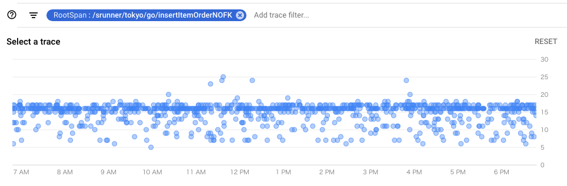
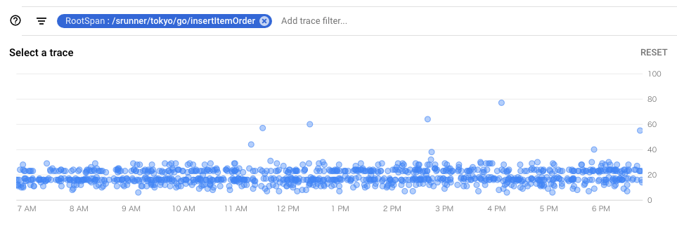
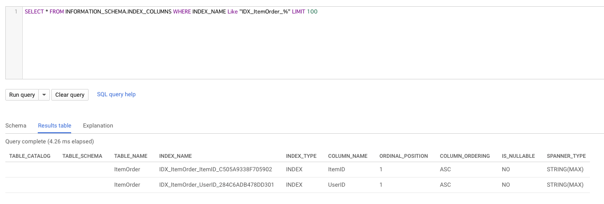

# Spanner Foreign Key Benchmark by sinmetal

tag["google-cloud-spanner"]

Foreign Keyの設定有無でWriteのPerformanceがどのぐらい変わるのか？を試してみた。

## Foreign Keyを作ると裏で何が起こる？

Foreign Keyを作ると自動的に [Backing indexes](https://cloud.google.com/spanner/docs/foreign-keys/overview#backing-indexes) を作成する。
どのようなindexが作成されたかは [INFORMATION_SCHEMA](https://cloud.google.com/spanner/docs/information-schema?hl=en#indexes)を見れば分かる。
データを更新する時はこのIndexを更新と参照先のTableに必要なRowがあるかをチェックする。

そのため、FKが無い状態と比べて、多少Performanceが落ちるだろうと思って、Benchmarkしてみた。

## 試してみた

今回は ItemMaster, User の2つのTableを作成し、この2つに対してFKを設定したItemOrder Tableに対して1行のINSERTを行うパターンを試してみた。
ItemMaster, User Tableには10,000,000件入っていて、この中からランダムにKeyを選ぶ。
FKの参照先はどちらもPK

```
CREATE TABLE ItemMaster (
	ItemID STRING(MAX) NOT NULL,
	Name STRING(MAX) NOT NULL,
	Price INT64 NOT NULL,
	CommitedAt TIMESTAMP NOT NULL OPTIONS (allow_commit_timestamp=true),
) PRIMARY KEY (ItemID);

CREATE TABLE User (
	UserID STRING(MAX) NOT NULL,
	Name STRING(MAX) NOT NULL,
	CommitedAt TIMESTAMP NOT NULL OPTIONS (allow_commit_timestamp=true),
) PRIMARY KEY (UserID)
```

### FKがないシンプルなTable

```
CREATE TABLE ItemOrderNoFK (
	ItemOrderID STRING(MAX) NOT NULL,
	ItemID STRING(MAX) NOT NULL,
	UserID STRING(MAX) NOT NULL,
	CommitedAt TIMESTAMP NOT NULL OPTIONS (allow_commit_timestamp=true),
) PRIMARY KEY (ItemOrderID)
```

まずはFKが無いシンプルな状態でのINSERTのBenchmark



### FKを設定したTable

```
CREATE TABLE ItemOrder (
	ItemOrderID STRING(MAX) NOT NULL,
	ItemID STRING(MAX) NOT NULL,
	UserID STRING(MAX) NOT NULL,
	CommitedAt TIMESTAMP NOT NULL OPTIONS (allow_commit_timestamp=true),
	FOREIGN KEY (ItemID) REFERENCES ItemMaster(ItemID),
	FOREIGN KEY (UserID) REFERENCES User(UserID),
) PRIMARY KEY (ItemOrderID)
```

次にFKを設定したもの



### FKで作成される Backing indexes と同じセカンダリインデックスを設定したTable

```
CREATE TABLE ItemOrderDummyFK (
    ItemOrderID STRING(MAX) NOT NULL,
    CommitedAt TIMESTAMP NOT NULL OPTIONS (allow_commit_timestamp=true),
    ItemID STRING(MAX) NOT NULL,
    UserID STRING(MAX) NOT NULL,
) PRIMARY KEY (ItemOrderID);

CREATE NULL_FILTERED INDEX ItemOrderDummyFK_ItemID
ON ItemOrderDummyFK (
    ItemID
);

CREATE NULL_FILTERED INDEX ItemOrderDummyFK_UserID
ON ItemOrderDummyFK (
    UserID
);
```

最後にFKが作っていたBacking indexesと同じセカンダリインデックスを設定したもの。
ItemIDとUserIDに対してASCのINDEXを貼っている。



### 見比べてみて

* FKなし : 16ms
* FKあり : 16ms ~ 20ms
* FKと同じセカンダリインデックス : 16ms ~ 18ms

ぐらいになった。
FKがあるとちょびっとだけLatencyは増える。
ただ、大きく増えるわけではないので、ものすごく気になるほどではない。
同じセカンダリインデックスのものと比べて微増しているように見えるのは、参照先のTableをチェックしているからなのではないかと思われる。

今回のケースではItemMater, Userは増減しない状態でItemOrderをINSERTしていってるので、参照元、参照先が激しく増減するようなケースではまた変わってくるかもしれない。
また、Latencyの増加は問題なくても、tx時のmutationが増える可能性があるのも気にした方がよいポイントかも知れない。
mutationについて調べたら [mutation の数え方](https://github.com/gcpug/nouhau/tree/master/spanner/note/mutation-count) を更新しようと思う。