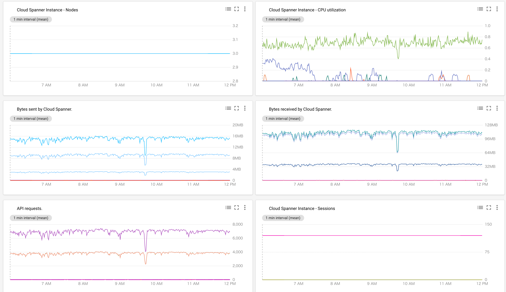
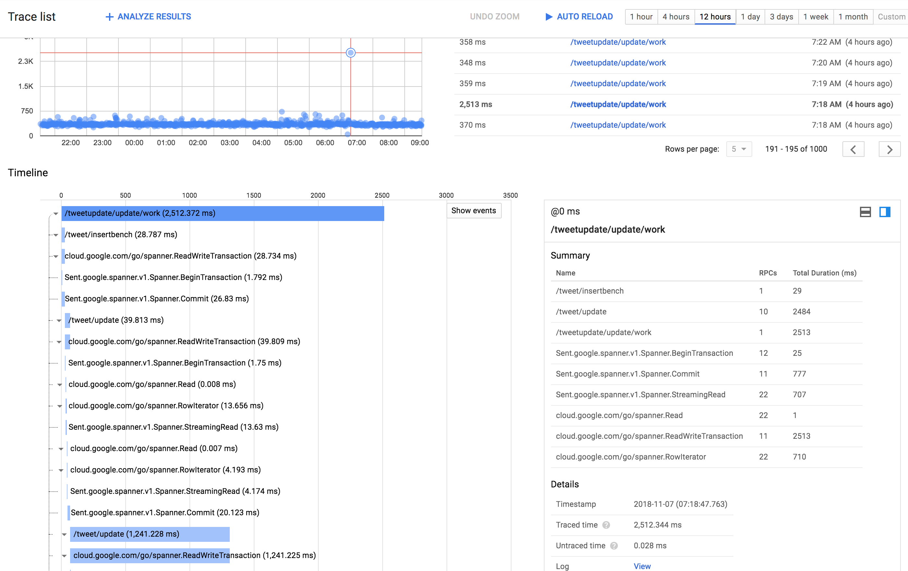

# Spanner Benchmark by sinmetal

tag["google-cloud-spanner"]

READ/WRITEを複数テーブルに行った時のBenchmark。
処理の内容にはさほど意味はなく、INSERT->UPDATE->UPDATEみたいな処理をすると、Performanceが上がらない？みたいな話があったので、ちょっと試してみた。
ちなみに、結論としては、 `INSERT->UPDATE->UPDATE` でPerformanceが上がらないということはなかった。

## 処理手順

* Tweet, Operation, TweetDummy1, TweetDummy2, TweetDummy3の5つのTableに同じTxでINSERTを行う

``` https://github.com/sinmetal/alminium_spanner/blob/8ec636214e22d6842d0951e5f0a8885a73bfec4c/tweet_store.go#L191
func (s *defaultTweetStore) InsertBench(ctx context.Context, id string) error {
	ctx, span := trace.StartSpan(ctx, "/tweet/insertbench")
	defer span.End()

	ml := []*spanner.Mutation{}
	now := time.Now()

	t := &Tweet{
		ID:         id,
		Content:    id,
		Favos:      []string{},
		CreatedAt:  now,
		UpdatedAt:  now,
		CommitedAt: spanner.CommitTimestamp,
	}
	tm, err := spanner.InsertStruct(s.TableName(), t)
	if err != nil {
		return err
	}
	ml = append(ml, tm)

	tom, err := NewOperationInsertMutation(uuid.New().String(), "INSERT", "", s.TableName(), t)
	if err != nil {
		return err
	}
	ml = append(ml, tom)

	for i := 1; i < 4; i++ {
		td := &TweetDummy{
			ID:         id,
			Content:    id,
			Favos:      []string{},
			CreatedAt:  now,
			UpdatedAt:  now,
			CommitedAt: spanner.CommitTimestamp,
		}
		tdm, err := spanner.InsertStruct(fmt.Sprintf("TweetDummy%d", i), td)
		if err != nil {
			return err
		}
		ml = append(ml, tdm)
	}
	_, err = s.sc.ReadWriteTransaction(ctx, func(ctx context.Context, txn *spanner.ReadWriteTransaction) error {
		return txn.BufferWrite(ml)
	})

	return err
}
```

* Tweet のCount Propertyをインクリメントする。その時,同じTxでTweetDummy2も取得する。

```
func (s *defaultTweetStore) Update(ctx context.Context, id string) error {
	ctx, span := trace.StartSpan(ctx, "/tweet/update")
	defer span.End()

	_, err := s.sc.ReadWriteTransaction(ctx, func(ctx context.Context, txn *spanner.ReadWriteTransaction) error {
		tr, err := txn.ReadRow(ctx, s.TableName(), spanner.Key{id}, []string{"Count"})
		if err != nil {
			return err
		}
		_, err = txn.ReadRow(ctx, "TweetDummy2", spanner.Key{id}, []string{"Id"})
		if err != nil {
			return err
		}

		var count int64
		if err := tr.ColumnByName("Count", &count); err != nil {
			return err
		}
		count++
		cols := []string{"Id", "Count", "UpdatedAt", "CommitedAt"}

		return txn.BufferWrite([]*spanner.Mutation{
			spanner.Update(s.TableName(), cols, []interface{}{id, count, time.Now(), spanner.CommitTimestamp}),
		})
	})

	return err
}
```

上記処理を120 goroutineでひたすら繰り返す。
1回の実行でのRWの回数は、10 Read / 6 Write なので、少しReadが多めぐらいの状態。

## 環境

### Region

全て `asia-northeast1`

### 実行環境

ClientはGKE上に構成された独自のアプリケーション。
ソースコードは https://github.com/sinmetal/alminium_spanner にある。

### GKE Spec

* Master version : 1.10.7-gke.2
* Machine Type : `n1-highcpu-8` をmin1, max12でオートスケールするように設定したNodePool

### Table

```
CREATE TABLE Tweet (
    Id STRING(MAX) NOT NULL,
    Author STRING(MAX) NOT NULL,
    CommitedAt TIMESTAMP NOT NULL OPTIONS (allow_commit_timestamp=true),
    Content STRING(MAX) NOT NULL,
    Count INT64 NOT NULL,
    CreatedAt TIMESTAMP NOT NULL,
    Favos ARRAY<STRING(MAX)> NOT NULL,
    Sort INT64 NOT NULL,
    UpdatedAt TIMESTAMP NOT NULL,
) PRIMARY KEY (Id);

CREATE INDEX TweetSortAsc
ON Tweet (
	Sort
);

CREATE TABLE Operation (
	Id STRING(MAX) NOT NULL,
	VERB STRING(MAX) NOT NULL,
	TargetKey STRING(MAX) NOT NULL,
	TargetTable STRING(MAX) NOT NULL,
	Body BYTES(MAX),
	CommitedAt TIMESTAMP NOT NULL OPTIONS (allow_commit_timestamp=true),
) PRIMARY KEY (Id);

CREATE INDEX OperationTargetKey
ON Operation (
TargetKey
);

CREATE INDEX OperationTargetTable
ON Operation (
TargetTable
);

CREATE TABLE TweetDummy1 (
    Id STRING(MAX) NOT NULL,
    Author STRING(MAX) NOT NULL,
    CommitedAt TIMESTAMP NOT NULL OPTIONS (allow_commit_timestamp=true),
    Content STRING(MAX) NOT NULL,
    Count INT64 NOT NULL,
    CreatedAt TIMESTAMP NOT NULL,
    Favos ARRAY<STRING(MAX)> NOT NULL,
    Sort INT64 NOT NULL,
    UpdatedAt TIMESTAMP NOT NULL,
) PRIMARY KEY (Id);

CREATE INDEX TweetDummy1SortAsc
ON TweetDummy1 (
	Sort
);

CREATE UNIQUE INDEX TweetDummy1Content ON TweetDummy1(Content);

CREATE TABLE TweetDummy2 (
    Id STRING(MAX) NOT NULL,
    Author STRING(MAX) NOT NULL,
    CommitedAt TIMESTAMP NOT NULL OPTIONS (allow_commit_timestamp=true),
    Content STRING(MAX) NOT NULL,
    Count INT64 NOT NULL,
    CreatedAt TIMESTAMP NOT NULL,
    Favos ARRAY<STRING(MAX)> NOT NULL,
    Sort INT64 NOT NULL,
    UpdatedAt TIMESTAMP NOT NULL,
) PRIMARY KEY (Id);

CREATE INDEX TweetDummy2SortAsc
ON TweetDummy2 (
	Sort
);

CREATE UNIQUE INDEX TweetDummy2Content ON TweetDummy2(Content);

CREATE TABLE TweetDummy3 (
    Id STRING(MAX) NOT NULL,
    Author STRING(MAX) NOT NULL,
    CommitedAt TIMESTAMP NOT NULL OPTIONS (allow_commit_timestamp=true),
    Content STRING(MAX) NOT NULL,
    Count INT64 NOT NULL,
    CreatedAt TIMESTAMP NOT NULL,
    Favos ARRAY<STRING(MAX)> NOT NULL,
    Sort INT64 NOT NULL,
    UpdatedAt TIMESTAMP NOT NULL,
) PRIMARY KEY (Id);

CREATE INDEX TweetDummy3SortAsc
ON TweetDummy3 (
	Sort
);

CREATE UNIQUE INDEX TweetDummy3Content ON TweetDummy3(Content);
```

## レポート

### 11/07 12:00 (Node3, Row:All Table 20,065,380件, DB Size 41.17 GB)

* WRITE : 4000Tx/sec
* READ : 7000/sec

9:45AMぐらいに一瞬、秒間処理量が下がってるけど、SpannerのCPU利用率も下がってるので、セッションが切れて貼り直したりしたのか、GCE側でLive Migrationでも起きたのかな・・・？
Trace見ると一回時間がすごくかかってるのがあって、それは途中のReadWriteTxを貼るのに時間がかかってた。




ちなみにこの処理を回してる時に、Client側はCPU5コアぐらい使ってた