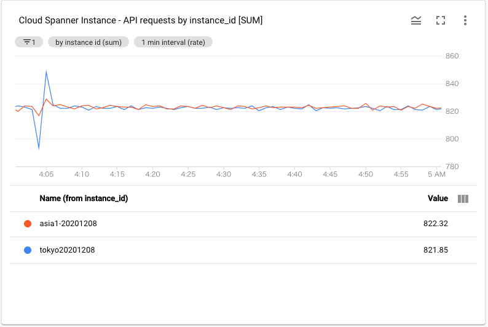
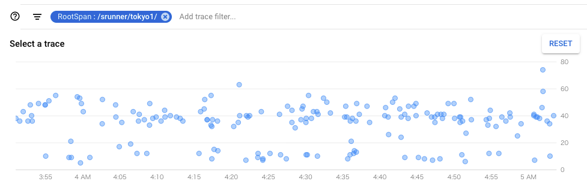
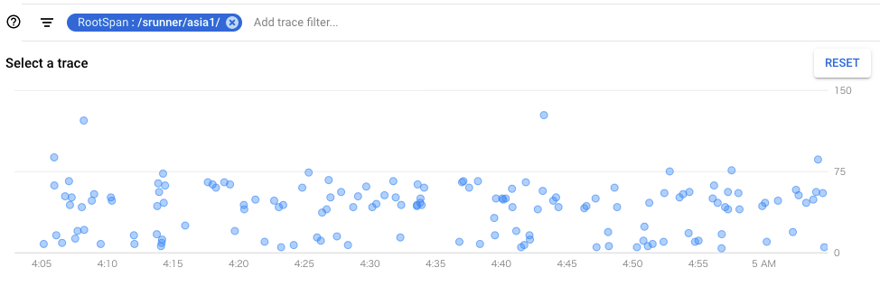
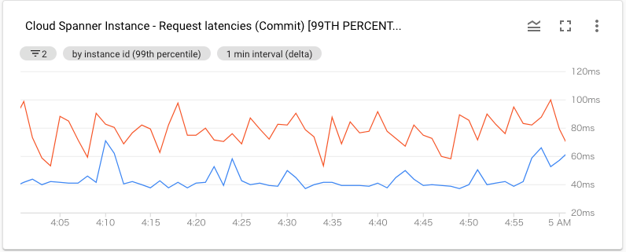
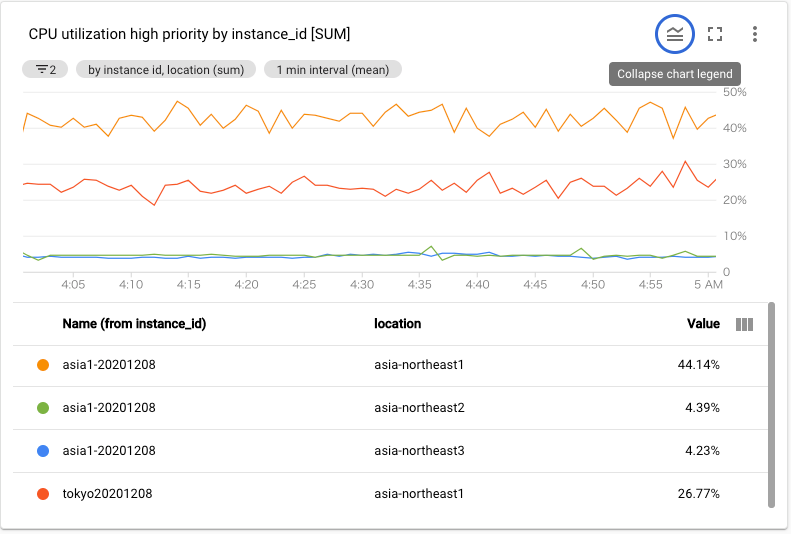
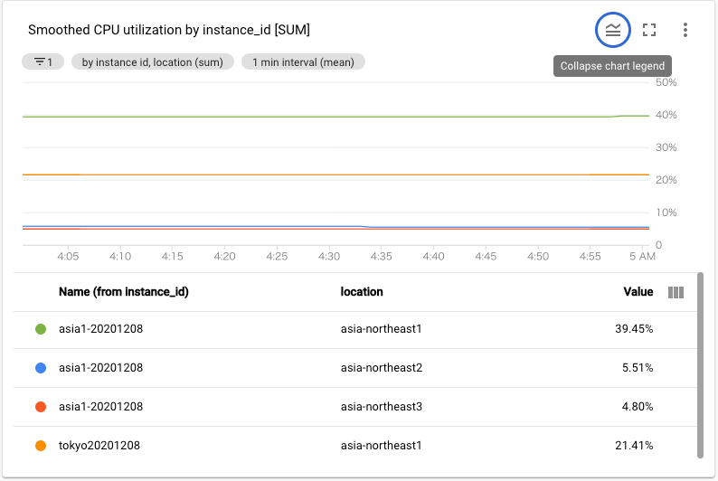

# Spanner Single Region VS Multi Region Benchmark by sinmetal

tag["google-cloud-spanner"]

Single Region と Multi Region でパフォーマンスにどのような差があるのかを調べたもの。
Write が多めのアプリケーションを動かして、計測している。

前回は [2019年10月に計測](https://github.com/gcpug/nouhau/commit/771bb27d81de2739ab24c39d3e39ccc2bd0e6a1d) したが、その時は tokyo をリーダーにする Multi Region の asia1 がなかったので、tokyo,nam3,nam-eur-asia1を比較している。
計測するアプリケーションのコードもバージョンアップした。

## 環境

### Spanner Region

* `tokyo` : Single Region
* `asia1` : One Continent

### Spanner Node Count

すべて 3

### 実行環境

ClientはGKE上に構成された独自のアプリケーション。
ソースコードは https://github.com/sinmetal/srunner/tree/runner-v2 にある。

cloud.google.com/go@v0.70.0

### GKE Spec

* Master version : 1.17.13-gke.1401
* Region : Tokyo

## レポート

### Request Count



今回は Read/Write 合わせておおよそ 800req/sec 送っている。
Write は Mutation API を使って行っていて、1つの Transaction はそんなに大きくはない。
Read は ID を指定した Get と Query が混ざっていて、Write は Insert/Update/Delete がある。
割合としては Write の方が多め。

### Stackdriver Trace

#### tokyo



#### asia1



### Spanner Request Latency



Commit Request の 99 Percentile Latency を抜き出してみると、こちらも asia1 の方が 30ms ほど遅くなっているのが分かる。

#### 感想

asia1 は tokyo と比べるとざっくり 30ms ほど遅くなっている。
tokyo, osaka 往復を考えると、まぁ、そんなもんだよなという印象。

### Spanner CPU Utilization

#### tokyo VS asia1





asia1 のリーダーである asia-northeast1(tokyo) が Single Region の asia-northeast1(tokyo) と比べると 2倍弱 ほどの CPU利用率になっている。
今回は、Request を送っている GKE は tokyo にいるので、asia1の asia-northeast2(osaka) は暇している。

## さいごに

Spanner　の　Single Region　と　Multi Region　はパフォーマンスと料金に差があるので、採用する時はしっかりと考えた上で採用するのがよさそう。
tokyo と asia1 で同じ CPU利用率にしようとすると、Node数を倍にする必要がある可能性があり、更に [Multi Region の方が High Priority を低く保つことが推奨されている。](https://cloud.google.com/spanner/docs/cpu-utilization)
Multi Region は Single Region の 3倍ほどのお値段なので、6倍以上の料金になる可能性も出てくる。

## おまけ asia1 の osaka region を働かせてみる

ベンチマーク時にはずっと osaka region は暇していたので、ちょっと働かせてみた。
Write はリーダーの tokyo 行くので、Read を osaka で実行すれば働いてくれる。

例えば、[Google 公式提供の Dataflow Template の Spanner to Cloud Storage Avro](https://cloud.google.com/dataflow/docs/guides/templates/provided-batch#cloudspannertogcsavro) を worker-region=osaka で実行すれば、osaka を働かせることができる。

```
gcloud dataflow jobs run {JOB_NAME} \
    --gcs-location='gs://dataflow-templates/latest/Cloud_Spanner_to_GCS_Avro' \
    --region=asia-northeast1 \
    --worker-region=asia-northeast2 \
    --parameters='instanceId={SPANNER INSTANCE ID},databaseId={SPANNER DB NAME},outputDir={YOUR GCS PATH}'
```

データの Durability のため、asia1 を使っているけど、osaka region は暇しているような構成の場合、Export Job や調査のための Query は osaka の worker から投げるようにすれば、有効活用できそう。

### おまけのおまけ

[Multi Region Best Practices](https://cloud.google.com/spanner/docs/instances#multi-region-best-practices) に `リーダー以外の Region の Node でパフォーマンスを最適化するには、15sec 以上の Staleness を指定するのがよい` と書いてあったので、worker が tokyo でも、この設定で Read すれば osaka に行ったりするのかな？と思って、 Staleness=30sec にして tokyo region で動いている GKE から Go のアプリケーションで Request を投げてみたけど、osaka には行かなかった。
少ししか試してないので、他の条件もあるかもしれないけど、worker とは別 Region の Node に Requesst を送るのは難しいのかもしれない。