# Spanner Single Region VS Multi Region Benchmark by sinmetal

tag["google-cloud-spanner"]

Single RegionとMulti Regionでパフォーマンスにどのような差があるのかを調べたもの。
WriteがHeavyなアプリケーションを動かして、計測している。

## 環境

### Spanner Region

* `tokyo` : Single Region
* `nam3` : One Continent
* `nam-eur-asia1` : Three Continent

### Spanner Node Count

すべて 3

### 実行環境

ClientはGKE上に構成された独自のアプリケーション。
ソースコードは https://github.com/sinmetal/srunner にある。

### GKE Spec

* Master version : 1.14.6-gke.13
* Machine Type : `n1-standard-2` を 2 Instance
* Region : SpannerのLeaderと同じRegionに配置

## レポート

### Stackdriver Trace

#### tokyo

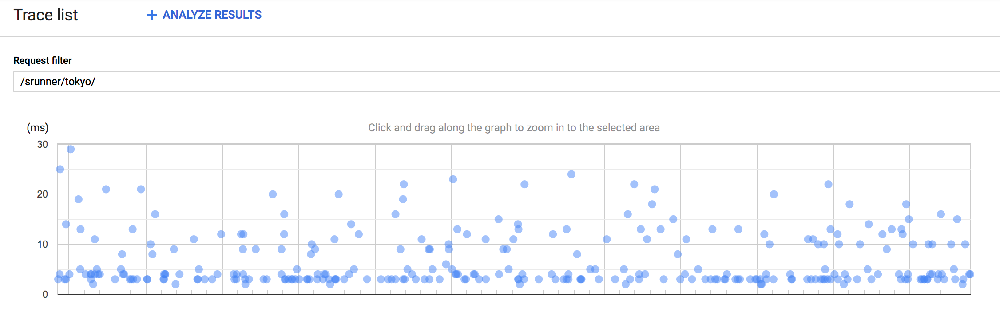

#### nam3

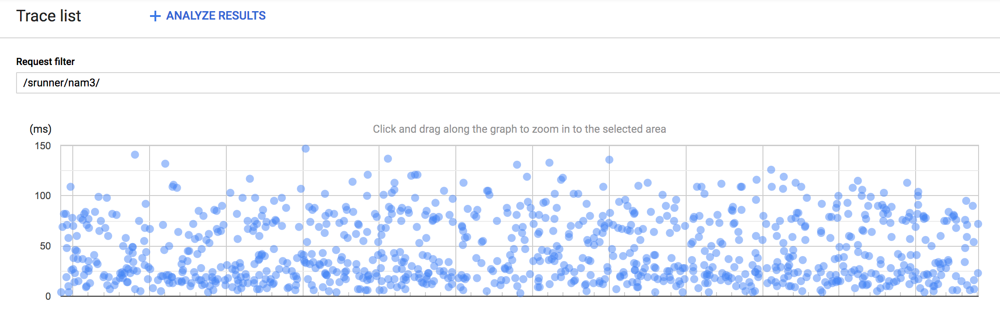

#### nam-eur-asia1

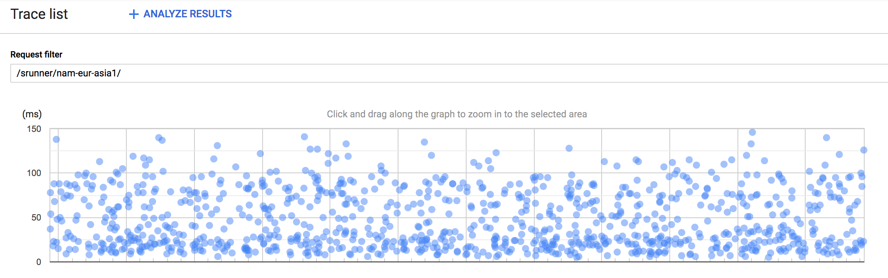

#### 感想

Single Regionであるtokyoが圧倒的に早い。
5msほどが主で、遅くても30msほどとなっている。
nam3, nam-eur-asia1は1つの大陸と、3つの大陸という違いがあるが、あまり差が見られない。
どちらも、30msぐらいが主で、100msぐらいまで散らばっており、150msもちょいちょいある印象となった。

### Spanner Request Latency

#### tokyo

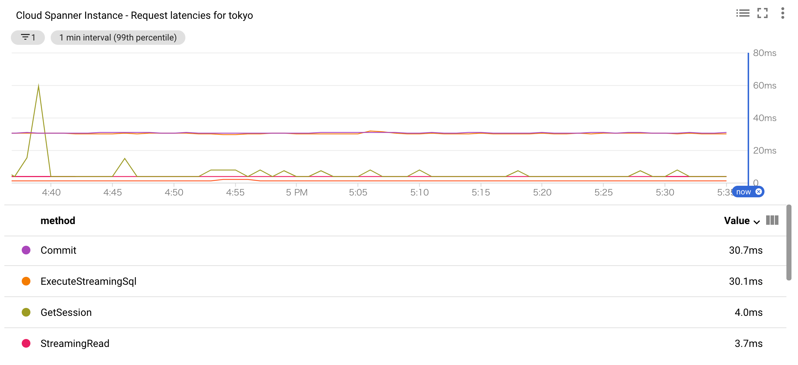
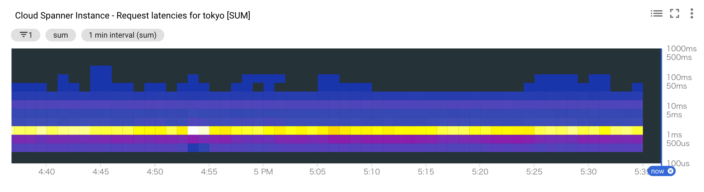

#### nam3

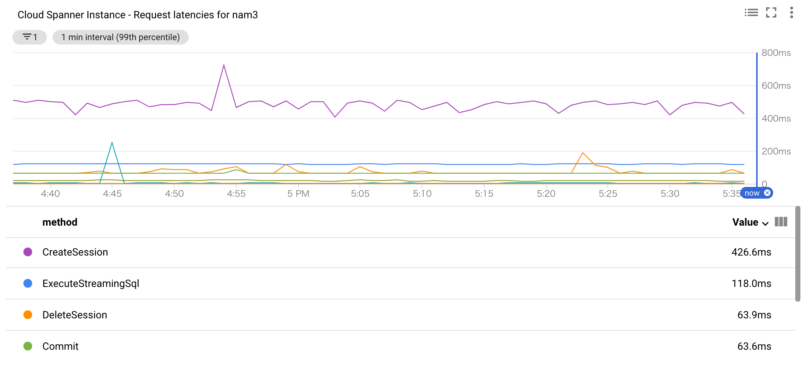
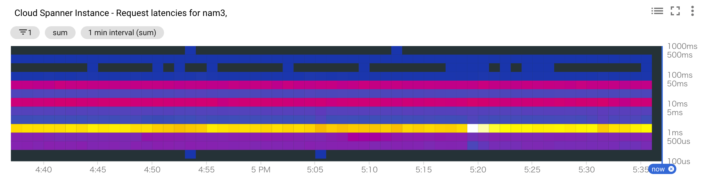

#### nam-eur-asia1

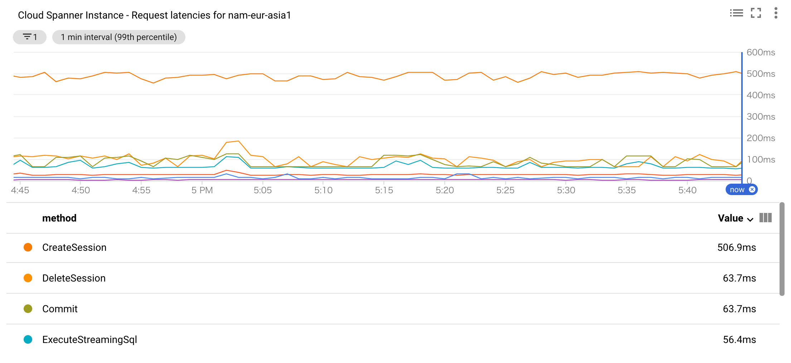
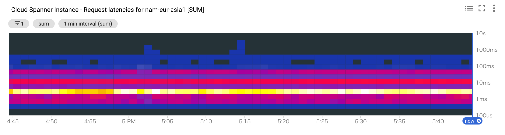

#### 感想

Spanner側のLatencyも、やはりtokyoの方が低く抑えられており、nam3とnam-eur-asia1はあんまり変わらない形となった。
1つ不思議な点として、nam3とnam-eur-asia1は常にCreateSessionが呼び出されている。
アプリケーション起動時に最初に一定数Sessionを作ってしまえば、後はそれを使い回すだけになるはずだが、謎が残った。

### Spanner CPU Utilization

#### tokyo

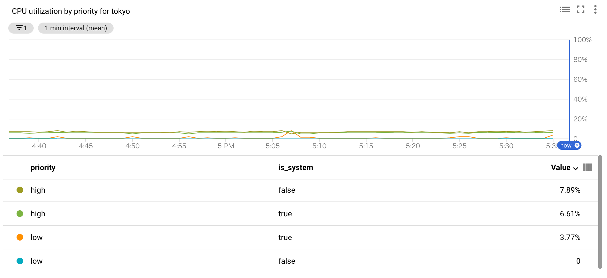

#### nam3

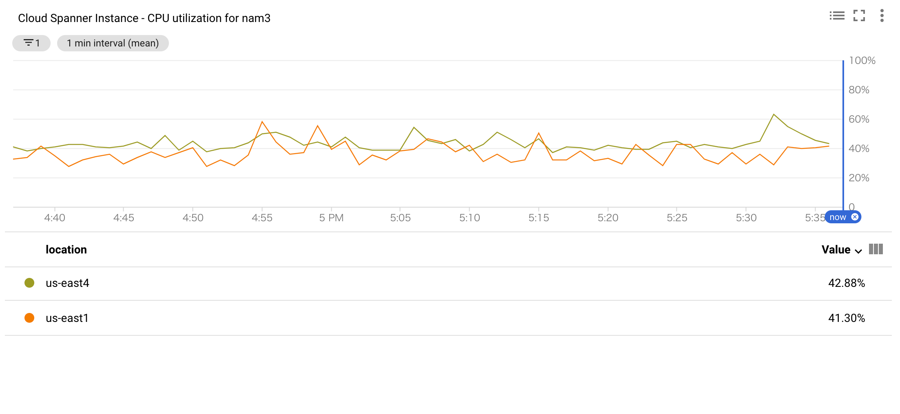
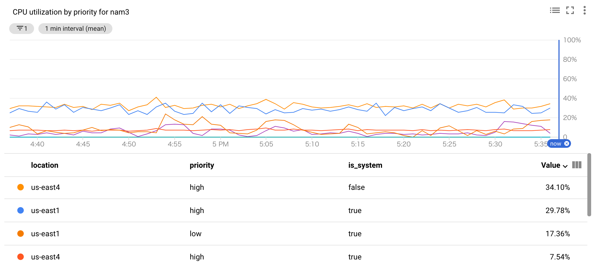

#### nam-eur-asia1

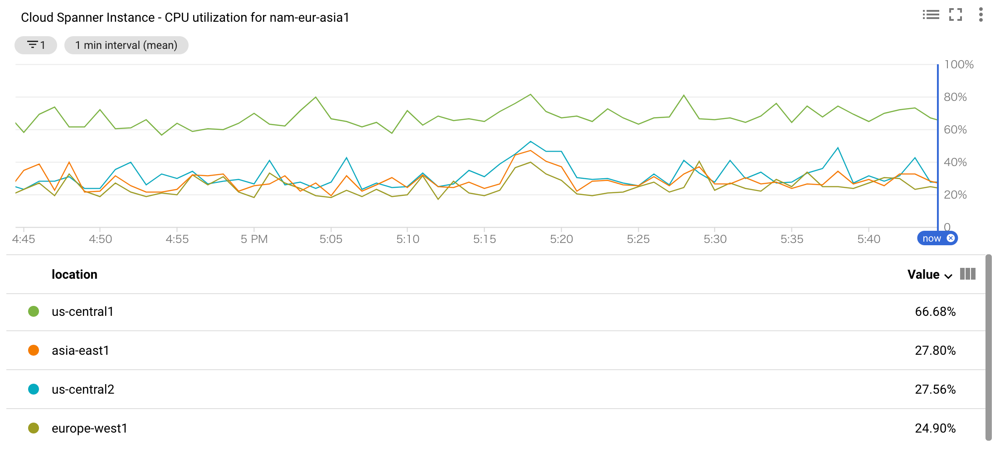
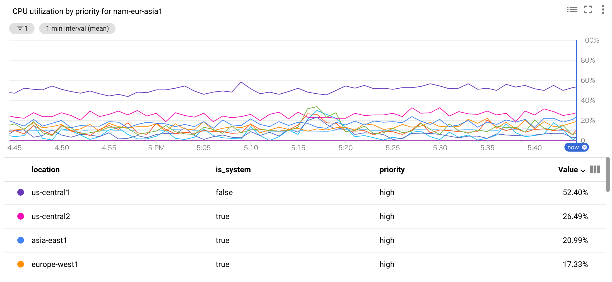

#### 感想

CPU利用率も最も低いのはSingle Regionであるtokyoとなった。
nam3とnam-eur-asia1は、Regionの数の差からか、nam-eur-asia1のLeaderであるus-central1が結構高くなっている。
今回試した内容だとRead Only Replicaたちは完全に暇しているので、Read Heavyなアプリケーションだと変わってくるとは思うが、Writeが多い場合は、Single RegionとMulti Regionで必要なNode数が変わってくる可能性が高い。
単純に計算すると、One ContinentだとSingle Regionの3〜4倍, Three ContinentだとSingle Regionの5〜6倍ほどのNode数が必要になる。

Single Regionの料金に比べて、One Continentが約3倍, Three Continentが約9倍の値段なので、Node数の増加を考慮すると、One Continentが9〜12倍, Three Continentが45〜54倍の料金がかかることになる。

そのため、自分たちは本当にMulti Regionが必要なのか？コストに見合うのか？は考える必要がありそう。

### Spanner Request Rate

#### tokyo

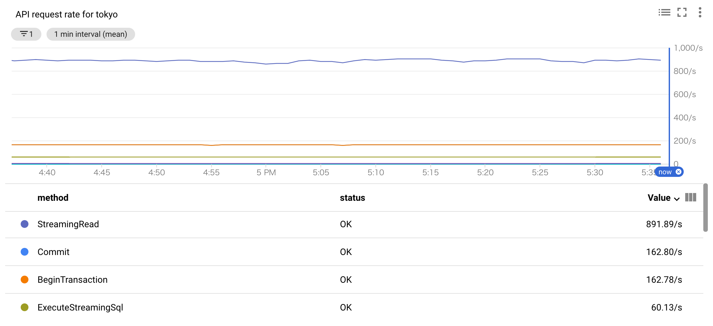

#### nam3

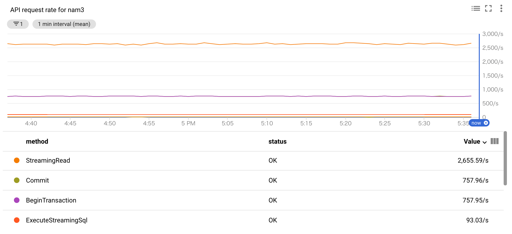

#### nam-eur-asia1

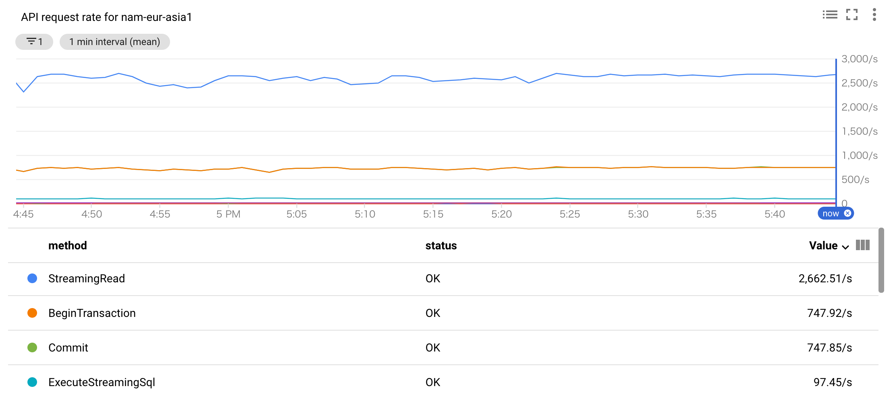

#### 感想

Single RegionとMulti Regionで傾向は同じだけど、Multi Regionの方が数が多くなっている。
Multi Regionの方がLatencyが高いぶん、少なくなりそうだが、多くなっているので、各RegionのSyncなども一緒にカウントされているのかもしれない。

### Spanner Session Count

#### tokyo

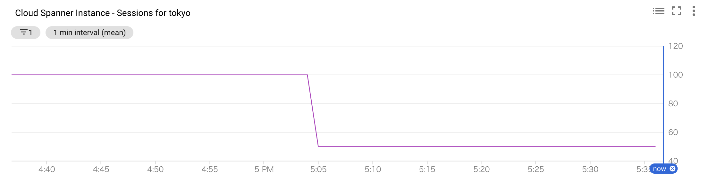

#### nam3

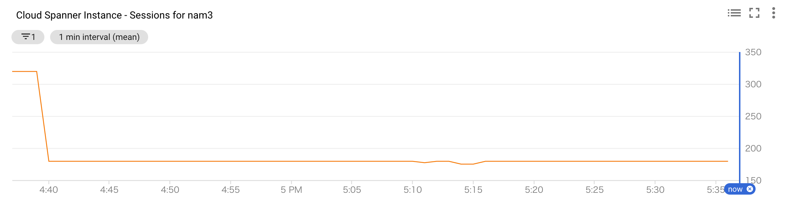

#### nam-eur-asia1

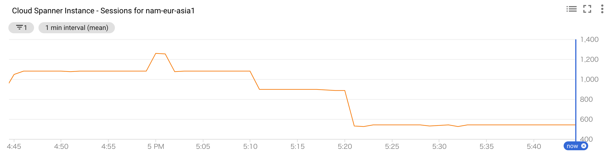

#### 感想

Single RegionよりMulti Regionの方がかなり多くなっている。
Multi RegionはCreate Sessionがずっと呼ばれたりしていたので、1つのアプリケーションからリクエストを送り続けた時でも、Sessionの管理の仕方がSingle Regionとは異なるのかもしれない・・・？

## さいごに

SpannerのSingle RegionとMulti Regionではパフォーマンスと料金には結構差があるので、採用する時はしっかりと考えた上で採用するのがよさそう。
今回は検証してないのだけど、[Timestamp bounds](https://cloud.google.com/spanner/docs/timestamp-bounds) もMulti Regionの時に力を発揮するものなので、この辺りも踏まえて設計すると、全体的なパフォーマンスを上げることができるだろう。