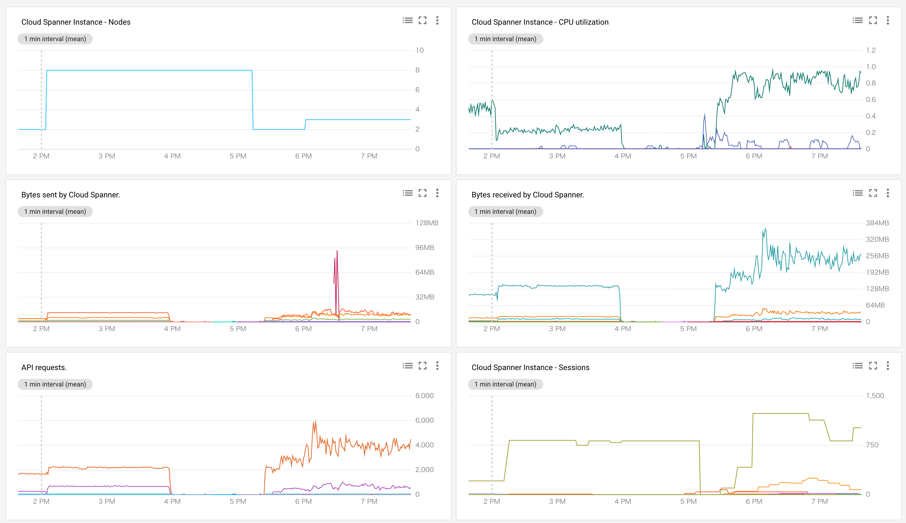
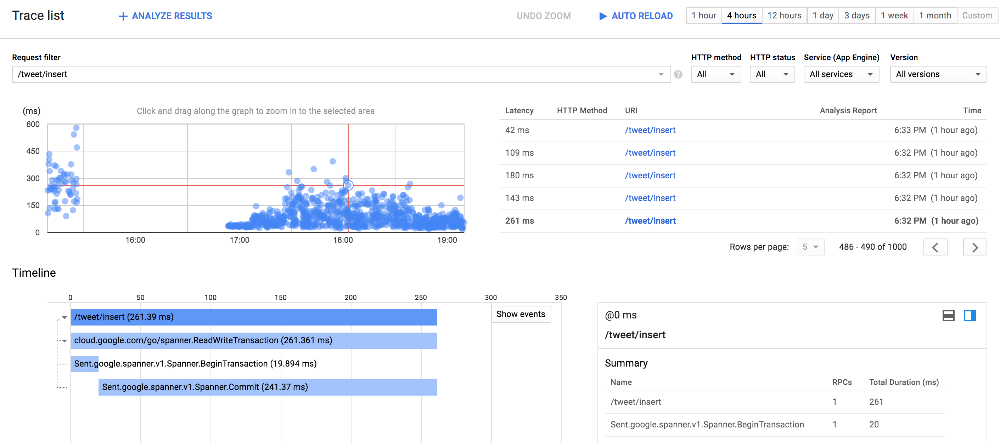
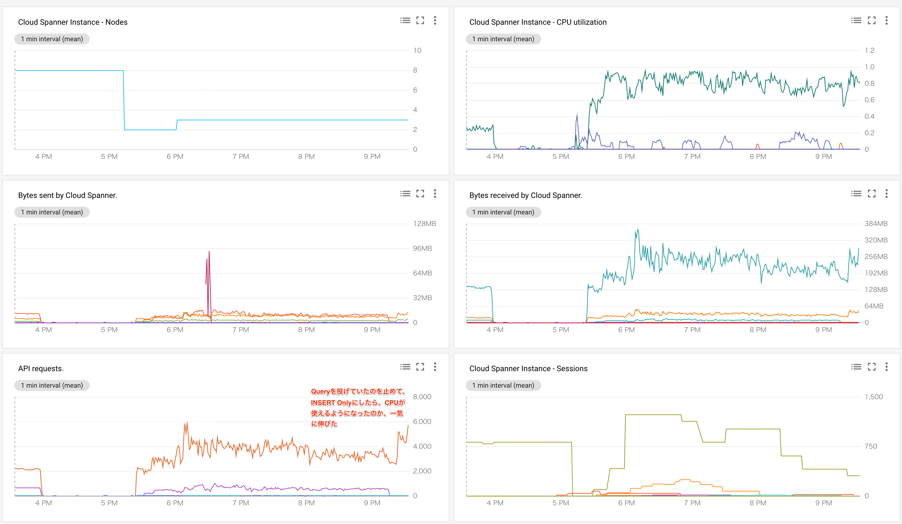
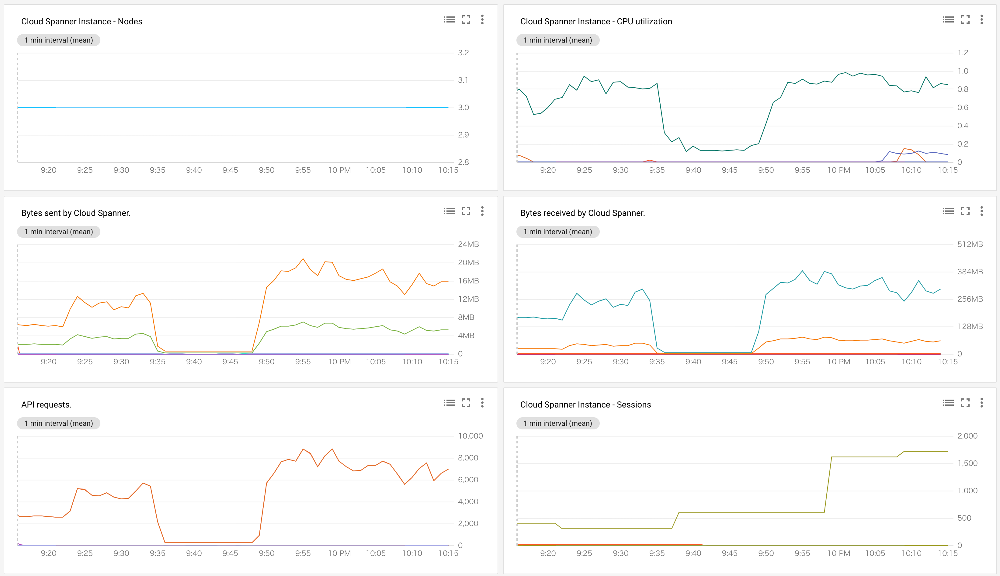
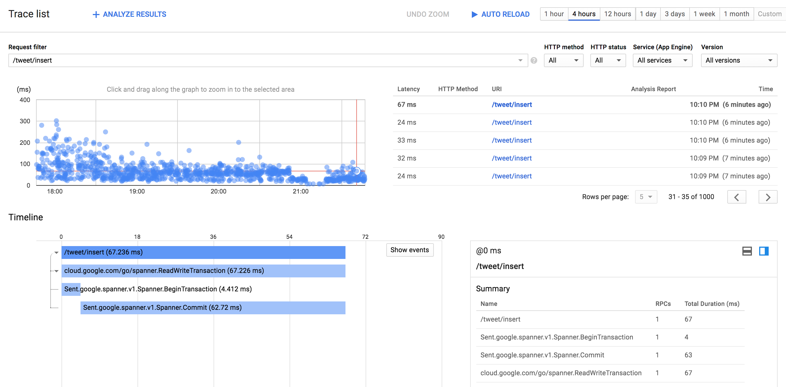
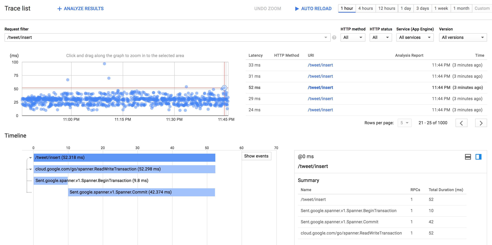
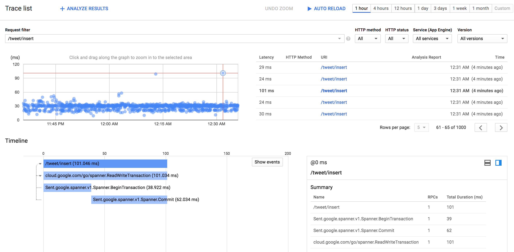
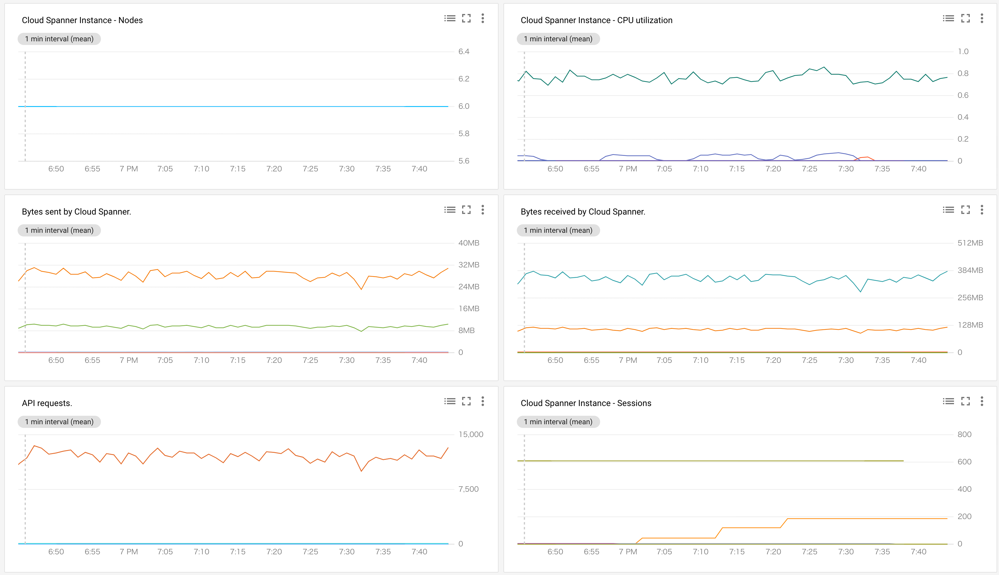
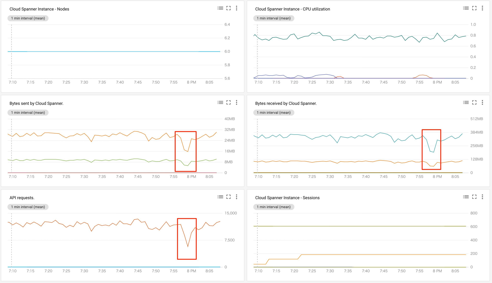

# Spanner Benchmark by @sinmetal

tag["google-cloud-spanner"]

The following is a performance test of Google Cloud Spanner’s WRITE capabilities.

## Environment

### Region

Set all regions to `asia-northeast1`

### Execution Environment

The client is a standalone application on GKE.
The source code can be found at https://github.com/sinmetal/alminium_spanner.

### GKE Specs

* Master Version : 1.10.7-gke.2
* Machine Type: A Nodepool which uses min1, max12 to auto-scale `n1-highcpu-8`

The settings for deployment are as shown below.

```
resources:
 limits:
   cpu: "8"
 requests:
   cpu: "3"
```

### Table

```
CREATE TABLE Tweet (
   Id STRING(MAX) NOT NULL,
   Author STRING(MAX) NOT NULL,
   CommitedAt TIMESTAMP NOT NULL OPTIONS (allow_commit_timestamp=true),
   Content STRING(MAX) NOT NULL,
   CreatedAt TIMESTAMP NOT NULL,
   Favos ARRAY<STRING(MAX)> NOT NULL,
   Sort INT64 NOT NULL,
   UpdatedAt TIMESTAMP NOT NULL,
) PRIMARY KEY (Id);

CREATE INDEX TweetSortAsc
ON Tweet (
        Sort
);
```
## Report

### 10/01 17:58 (Node2, Row: 38,496,016 cases, 14GB)

WRITE was being performed constantly, but the performance tended to drop when CPU usage by spanner approached 100%.


### 10/01 19:39 (Node3, Row: 61,435,626 cases, 22GB)

* WRITE: 4000Tx/sec
* READ: Send a query, and read it as appropriate.

If a query referencing INDEX using READ is sent, this can eat up the CPU.




### 10/01 21:35 (Node3, Row: 82,895,935 cases, 30GB)

* WRITE: 6000Tx/sec
* READ: 0

After changing it to write only and suspending reading, the processing capacity increased perhaps due to a CPU being freed up, resulting in stabilized performance.




### 10/01 22:16 (Node3, Row: 90,493,505 cases, 33GB)

* WRITE: 8000Tx/sec
* READ: 0

At at Tx of 8000, using 3 nodes is barely sufficient and will have an impact on performance. 




### 10/01 23:47 (Node3, Row: 111,232,846 cases, 41GB)

* WRITE: 4000Tx/sec
* READ: 0

Stable performance was achieved at 4000Tx.




### 10/02 00:35 (Node3, Row: 126,998,904 cases, 47GB)

* WRITE: 6000Tx/sec
* READ: 0

Stable performance was achieved even at 6000Tx.




### 10/02 19:45 (Node6, Row: 688,554,866 cases, 256GB)

* WRITE: 12000Tx/sec
* READ: 0

The number of nodes was increased to six.
As the Tx goes over 12000, CPU usage reaches 80% and performance becomes slightly unstable.
We should be able to achieve stable performance at 8000Tx, if stable performance can be achieved at 4000Tx with three nodes.




## Extras

### spanner.ClientConfig.NumChannels

* I tried using the setting `spanner.ClientConfig.NumChannels:60`, but this didn’t have much of an effect.
* The client is not that big of a machine, so maybe it wasn’t that useful in having a large amount of NumChannels.
* Also, only 50 Goroutines were being run, so maybe more are needed.

### High Load Queries

* When using a lot of CPU for WRITE, sending high-load queries which trigger full scans will in turn significantly decrease WRITE numbers. 
* However, the capacity used for WRITE is restored before the query is completed.

