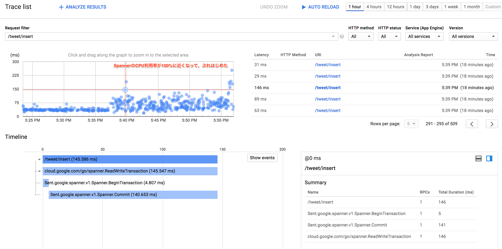
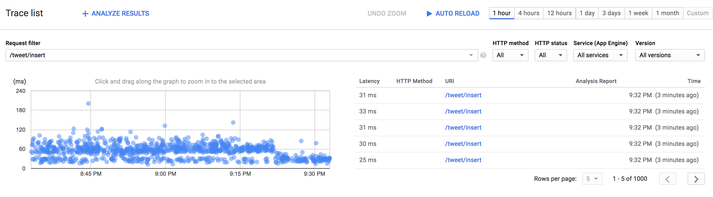
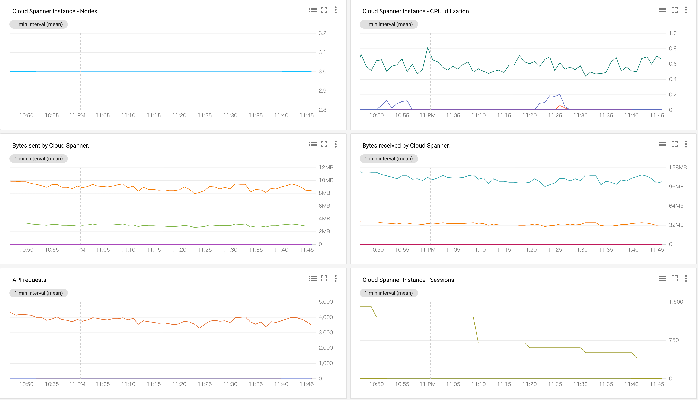
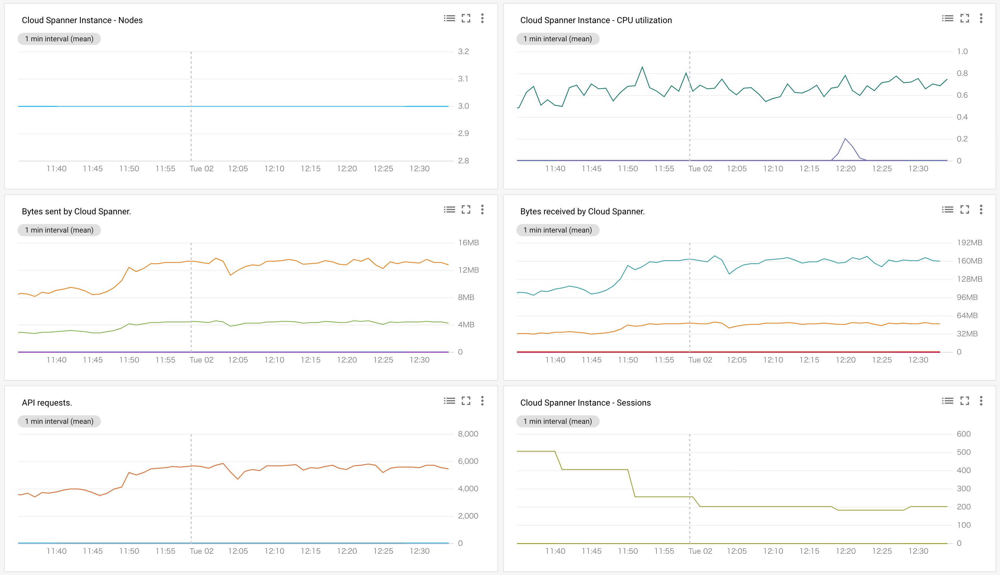
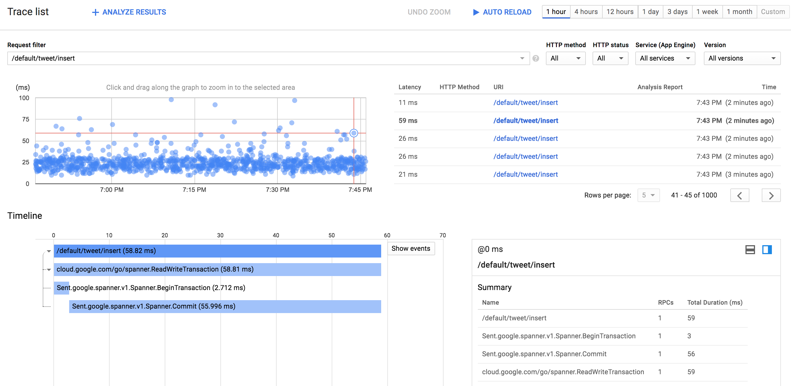

# Spanner Benchmark by sinmetal

tag["google-cloud-spanner"]

だいたいWRITEのPerformanceがどのぐらい出るのかを調べてる感じのもの。

## 環境

### Region

全て `asia-northeast1`

### 実行環境

ClientはGKE上に構成された独自のアプリケーション。
ソースコードは https://github.com/sinmetal/alminium_spanner にある。

### GKE Spec

* Master version : 1.10.7-gke.2
* Machine Type : `n1-highcpu-8` をmin1, max12でオートスケールするように設定したNodePool

Deploymentは以下のように設定している。

```
resources:
  limits:
    cpu: "8"
  requests:
    cpu: "3"
```

### Table

```
CREATE TABLE Tweet (
    Id STRING(MAX) NOT NULL,
    Author STRING(MAX) NOT NULL,
    CommitedAt TIMESTAMP NOT NULL OPTIONS (allow_commit_timestamp=true),
    Content STRING(MAX) NOT NULL,
    CreatedAt TIMESTAMP NOT NULL,
    Favos ARRAY<STRING(MAX)> NOT NULL,
    Sort INT64 NOT NULL,
    UpdatedAt TIMESTAMP NOT NULL,
) PRIMARY KEY (Id);

CREATE INDEX TweetSortAsc
ON Tweet (
	Sort
);
```
## レポート

### 10/01 17:58 (Node2, Row:38,496,016件)

ひたすらWRITEを行っていたが、基本的にSpannerのCPU利用率が100%に近付くと、Performanceが落ちるような印象だった。



### 10/01 19:39 (Node3, Row:61,435,626件)

* WRITE : 4000Tx/sec
* READ : クエリを投げつつ、適当にRead

READでINDEXを参照するクエリを投げていたら、地味にCPUを使っていて、CPU利用率がつらそうな感じに


### 10/01 21:35 (Node3, Row:82,895,935件)

* WRITE : 6000Tx/sec
* READ : 0

READを止めて、WRITE Onlyにしたところ、CPUが空いたのか、処理できる量が増え、Performanceも安定した




### 10/01 22:16 (Node3, Row:90,493,505件)

* WRITE : 8000Tx/sec
* READ : 0

8000Txまで行くと、3Nodeでは結構つらそうで、Performanceがぶれる。


### 10/01 23:47 (Node3, Row:111,232,846件)

* WRITE : 4000Tx/sec
* READ : 0

4000TxぐらいがPerformanceが安定して、平和な感じ。




### 10/02 00:35 (Node3, Row:126,998,904件)

* WRITE : 6000Tx/sec
* READ : 0

6000TxぐらいでもPerformanceが安定して、だいたい平和な感じ。




### 10/02 19:45 (Node6, Row:688,554,866件)

* WRITE : 12000Tx/sec
* READ : 0

Nodeを6つに増やしてみた。
12000Txを超えると、CPU利用率が80%ぐらいにいって、ちょっとPerformanceがぶれる。
Node3の時が4000が安定していたことを考えると、8000が安定しそう。




## おまけ

途中で `spanner.ClientConfig.NumChannels:60` とかを試しに設定してみたけど、特に変化はなかった。
クライアントがそんなに大きなマシンではないので、NumChannelsがたくさんあっても、特に意味はなかったのかな？
また、同時に回してたgoroutineは50個だったので、それが少ないとかもあったのかもしれない。
