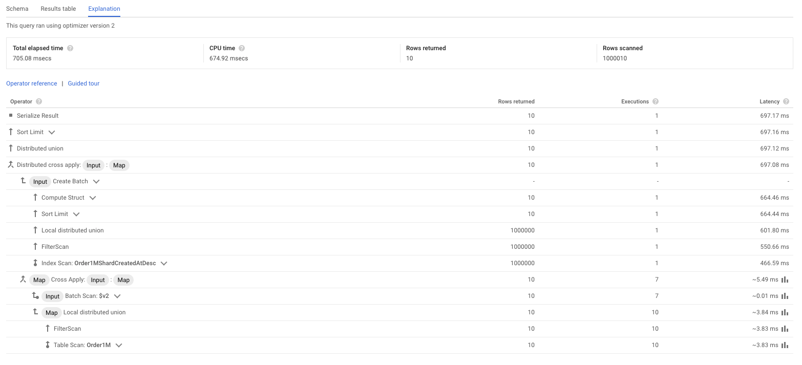
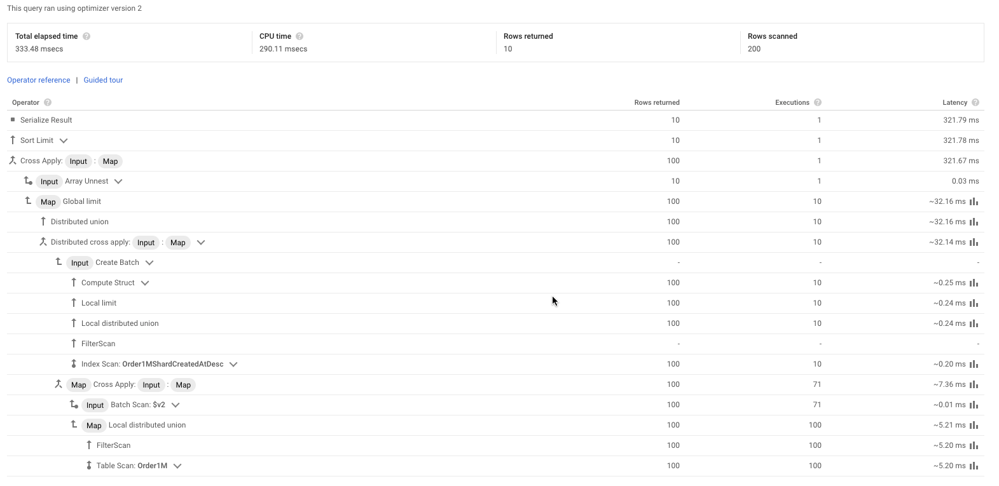
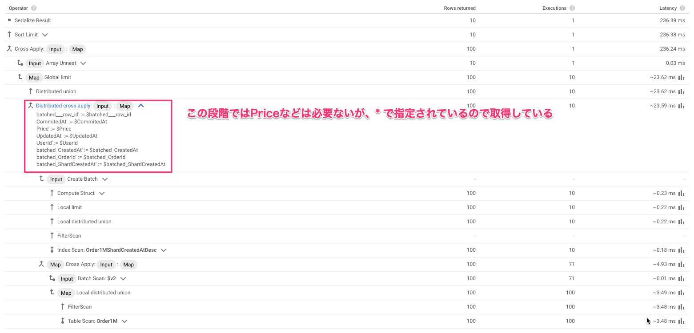
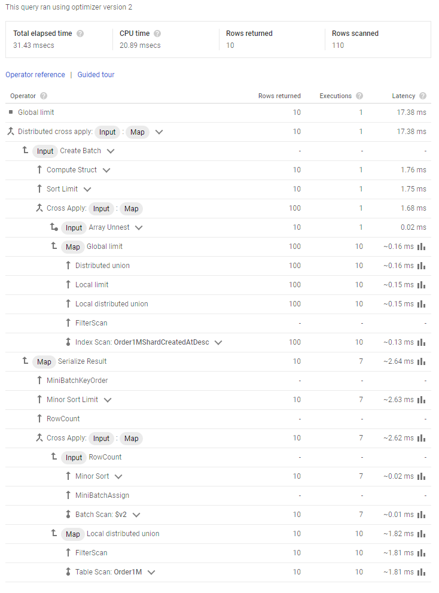

# Shard

tag["google-cloud-spanner"]

SpannerはKeyの値でSortしてSplitを分割して保存しています。
気を付けることとして、特定のSplitにアクセスが集中し、HotSpotを生み出さないようにします。
HotSpotになりがちなものとして、単調増加もしくは減少する値をKeyにするケースがあります。
そのため [PKにはUUIDのような順序がばらばらになる値を利用することが推奨](https://cloud.google.com/spanner/docs/schema-design?hl=en#ordering_timestamp-based_keys) されています。

これはセカンダリインデックスにも適用されます。
[タイムスタンプのように単調増加する値にセカンダリインデックスを設定することはアンチパターン](https://cloud.google.com/spanner/docs/schema-design?hl=en#creating-indexes) です。
とは言え、最新の10件を取得したいという要件はよくあるので、このような時は自分でShardを追加して、Shardingを行います。
(BigtableもSpannerとおなじようにKeyでSortされるので、同じようなことをすることがありますが、Documentでは [Salting](https://cloud.google.com/bigtable/docs/schema-design-time-series?hl=en#ensure_that_your_row_key_avoids_hotspotting) と呼ばれています。)

## Shardの値はどのように決める？

Shardの値はHotSpotを回避できればよいので、順番がばらばらであればなんでもよいです。
[この記事](https://cloud.google.com/blog/products/gcp/sharding-of-timestamp-ordered-data-in-cloud-spanner) のようにHotSpotを回避したい値からcrc32を計算するみたいなものでもよいし、乱数でもかまいません。
ただ、Shardの値はインデックスを利用する時に知っている必要があるパターンや、パフォーマンスに影響を与えるので、そのインデックスに対してどのようにクエリを投げるか？を考えて設計します。

### フィルタリングに利用する

タイムスタンプのように単調増加する値以外でも、偏りが存在する値であればHotSpotを回避するためにShardを利用することがあります。
例えば、DomainごとにSessionを生成するケースで、Domainごとにアクセス数の偏りがあるようなケースや、外部サービスのUserIdなど、自分では設計できない値がシーケンシャルなケースです。

```
CREATE TABLE Session (
	Id STRING(MAX),
	Domain STRING(MAX) NOT NULL,
	PartnerUserId INT64 NOT NULL,
	Role STRING(MAX) NOT NULL,
    Expire TIMESTAMP NOT NULL,
) PRIMARY KEY (Id)
```

```
SELECT * 
FROM Session
WHERE Domain = "gcpug.jp" AND PartnerUserId = 1
```

上記のようなフィルタリングを行うケースを考えます。
このケースにShardを追加する場合、Shardの値はDomainとPartnerUserIdが分かれば、算出できる値がよいです。
Shardを含むセカンダリインデックスをフィルターで活用するためには、Shardを含めてクエリを実行する必要があります。
クエリ実行する時にShardも分かっていればよいですが、大抵DomainとPartnerUserIdしか分かっていないので、この2つの値からShardを算出できるのが都合が良いです。
例えば、DomainとPartnerUserIdを文字列連結して、csc32を計算して10で割った余りをShardとして設定します。

```
CREATE TABLE Session (
	Id STRING(MAX),
	Domain STRING(MAX) NOT NULL,
	PartnerUserId INT64 NOT NULL,
    DomainPartnerUserIdShard INT64 NOT NULL,
	Role STRING(MAX) NOT NULL,
    Expire TIMESTAMP NOT NULL,
) PRIMARY KEY (Id)

CREATE INDEX SessionDomainPartnerUserIdShardDomainParnerUserId 
ON Session (
	DomainPartnerUserIdShard,
	Domain,
	PartnerUserId
)
```

```
SELECT * 
FROM Session@{FORCE_INDEX=SessionDomainPartnerUserIdShardDomainParnerUserId} 
WHERE DomainPartnerUserIdShard = 6
  AND Domain = "gcpug.jp"
  AND PartnerUserId = 1
```

#### 余談

PartnerUserIdのように外部の値でシーケンシャルなものに関しても、そのまま保存するのではなく、少し加工することで順番をばらばらにするという手もあります。
例えばMD5などのハッシュ関数を実行した値を前方に付与します。(1の場合だと c4ca4238a0b923820dcc509a6f75849b-1)
このようにすれば、1という値さえ分かっていればフィルタリングできるし、PartnerUserId Columnを見た時に元の値が1だということも分かります。
これでDomainの偏りが気にならないのであれば、Shardは必要なくなります。

```
SELECT * 
FROM Session@{FORCE_INDEX=SessionDomainPartnerUserId} 
WHERE Domain = "gcpug.jp"
  AND PartnerUserId = "c4ca4238a0b923820dcc509a6f75849b-1"
```

### 最新 N件を取得する

Shardを追加したインデックスを利用する場合、 [この記事](https://cloud.google.com/blog/products/gcp/sharding-of-timestamp-ordered-data-in-cloud-spanner) では以下のようなクエリを実行しています。
このケースでは ShardCreatedAt は 0 ~ 9 の値を入れているので、その範囲を明示しています。

#### V1

```
CREATE INDEX Order1MShardCreatedAtDesc
  ON Order1M (ShardCreatedAt, CreatedAt DESC)

SELECT * 
FROM Order1M@{FORCE_INDEX=Order1MShardCreatedAtDesc} 
WHERE ShardCreatedAt BETWEEN 0 AND 9
ORDER BY CreatedAt DESC 
LIMIT 10
```

ただ、このクエリを実行するとTableをフルスキャンしてしまいます。
以下は1000000件あるTableに対してクエリしたケースです。



#### V2

フルスキャンをしないようにするには、もっとうまくShardを利用するようにSpannerに教えてあげる必要があります。
最新N件は、各Shardの最新N件の中に含まれているはずなので、セカンダリインデックスを指定して各ShardからN件を取得し、その後更に並び替えて最新N件を取得します。
これでTableをフルスキャンせず、N * Shardの数で済むようになりました。

ここで気にするのが最低でも N * Shardの数 はスキャンする必要があるという点です。
Shardの数が多ければ、スキャンする数も増えていってしまうので、Shardの数を増やすとパフォーマンスが落ちていきます。
Shardの数を増やせばINSERT時のHotSpotを回避できることが期待できますが、このようにSELECTする時は遅くなってしまいます。
そのため、WRITE, READ どちらが早い方がよいだろうか？というのを考えて値を設定する必要があります。

```
SELECT c.*
FROM (
  SELECT 
    ARRAY(
      SELECT AS STRUCT *
      FROM Order1M@{FORCE_INDEX=Order1MShardCreatedAtDesc}
      WHERE ShardCreatedAt = OneShardCreatedAt
      ORDER BY CreatedAt DESC LIMIT 10
    ) AS ar
  FROM UNNEST(GENERATE_ARRAY(0, 9)) AS OneShardCreatedAt
) b, UNNEST(ar) c
ORDER BY c.CreatedAt DESC
LIMIT 10
```



#### V2.1

V2.1のクエリはV2と実行計画は同じもので、ちょっと書き方を変えたものです。

```
SELECT c.*
FROM UNNEST(GENERATE_ARRAY(0, 9)) AS OneShardCreatedAt,
     UNNEST(ARRAY(
      SELECT AS STRUCT *
      FROM Order1M@{FORCE_INDEX=Order1MShardCreatedAtDesc}
      WHERE ShardCreatedAt = OneShardCreatedAt
      ORDER BY CreatedAt DESC LIMIT 10
    )) AS c
ORDER BY c.CreatedAt DESC
LIMIT 10
```


#### V3

V2.xのクエリにはまだ無駄があり、セカンダリインデックスからN件取得するところで、セカンダリインデックスに含まれないColumnも取得しているので、セカンダリインデックスと実際のRowの間でJOINが走っています。
そのため、最終的なRows scannedが100件読み込んだだけのつもりですが、200件になっています。



これを更に改良したのが以下のクエリです。
セカンダリインデックスから取得するのはインデックスに含まれるColumnのみに限定し、目的の最新10件のみにしたところで、実TableをJOINするように明示的に書いています。
これでRows scannedはセカンダリインデックスを取得している100件と最後に確定した最新10件の元Tableをくっつけて、110件になりました。

```
SELECT * FROM (
  SELECT c.*
  FROM UNNEST(GENERATE_ARRAY(0, 9)) AS OneShardCreatedAt,
      UNNEST(ARRAY(
         SELECT AS STRUCT OrderId, CreatedAt
         FROM Order1M@{FORCE_INDEX=Order1MShardCreatedAtDesc}
         WHERE ShardCreatedAt = OneShardCreatedAt
         ORDER BY CreatedAt DESC LIMIT 10
      )) AS c
  ORDER BY c.CreatedAt DESC
  LIMIT 10
)
INNER JOIN Order1M USING(OrderId)
```



### まとめ

Rowの分布に偏りがありえる時に無作為に順番をばらばらにするためにShardは利用されます。

Shardを追加した場合、Read時にはShardのことを考慮してクエリを書く必要があります。

フィルター条件として利用する場合、Shardの値を知っている必要があります。
そのため、フィルター条件のShard以外の値から算出しておくのが楽です。

単調増加する値に対してセカンダリインデックスを追加する時にShardを追加した場合、クエリは複雑になります。
最新 N件取得する場合は N * Shardの数を読み込むことになるので、Shardの数はあまり多くない方がよいです。

この他にもHotSpotを回避する手段は色々あります。
どのようにデータにアクセスしたいのかを考えて、ちょうどよい塩梅を探っていきましょう。