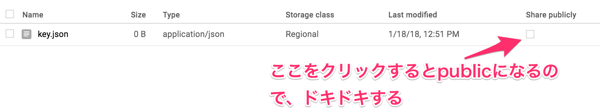
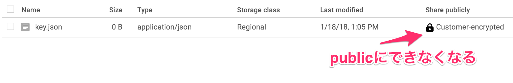

# Customer-supplied encryption keys Introduction

tag:["google-cloud-storage", "customer-supplied-encryption-keys"]

Cloud Storage上のファイルを自分で指定したKeyで暗号化する [Customer-supplied encryption keys](https://cloud.google.com/storage/docs/encryption#customer-supplied) の紹介です。

## Customer-supplied encryption keys の使い所

* Permission missでファイルが流出するのを防ぎたい

Customer-supplied encryption keyの使いどころは、ほぼ `Permission missでファイルが流出するのを防ぎたい` の一言です。
Cloud Storage上のファイルは通常Google側で暗号化されていますが、もちろん我々がダウンロードする時は復号化されてダウンロードされます。
ダウンロードするためにはPermissionが必要なので、Permissionの設計に誤りが無ければ、問題ありませんが、オペミスなども考えられます。



そんな時、Customer-supplied encryption keysを設定しておけば、ダウンロードの敷居を上げることができます。
また、Customer-supplied encryption keysを設定したObjectはCloud Console上からPublicにするチェックボックスが消滅するので、誤クリックすることがなくなります。
ただし、Cloud ConsoleはCustomer-supplied encryption keysに対応してないので、Upload, Downloadはgsutilを使うことになります。



## gsutilで使う

Customer-supplied encryption keysをgsutilで利用する場合は、 `$HOME/.boto` に以下のファイルを置きます。

```
[GSUtil]
encryption_key = {Your Encryption Key}
```

Encryption KeyはBase64 エンコードされた AES-256 暗号鍵を指定します。
生成のサンプルは [Generating your own encryption key](https://cloud.google.com/storage/docs/using-encryption-keys#generating_your_own_encryption_key) に書いてあります。
とりあえず、試したいだけなら、私が生成した以下を使うとよいです。

```
[GSUtil]
encryption_key = IOi0eXy/Px0Lc7r426fSBfJwx5Ntm3Vl9yNgObeSJfU=
```

後は通常通り、gsutilを利用するだけです。
gsutilでファイルをアップロードすれば、暗号化され、ダウンロードするにも同じKeyを設定している必要があります。
他にもKeyのRotationの機能なんかもあるので、詳細は [Using Customer-Supplied Encryption Keys](https://cloud.google.com/storage/docs/using-encryption-keys) を確認してください。

## Goで使う

Customer-supplied encryption keysをGoで利用する場合、 [Cloud Client Library](https://github.com/GoogleCloudPlatform/google-cloud-go) を使うと簡単です。
Upload, Downloadいずれも32byteのEncryption Keyを渡してやるだけです。
サンプルコードは [storage_playground](https://github.com/sinmetal/storage_playground) にあります。

``` Go
// Upload is ファイルをCloud StorageにUploadする
func (s *StorageService) Upload(ctx context.Context, encryptKey []byte, bucketName string, objectName string, file []byte) (int, error) {
	bucket := s.C.Bucket(bucketName)
	obj := bucket.Object(objectName).Key(encryptKey) // ここでEncryptKeyを指定
	w := obj.NewWriter(ctx)

	size, err := w.Write(file)
	if err != nil {
		return 0, errors.Wrapf(err, "file write error")
	}

	if err := w.Close(); err != nil {
		return 0, errors.Wrapf(err, "file writer close error")
	}

	return size, nil
}

// Download is ファイルをCloud StorageからDownloadする
func (s *StorageService) Download(ctx context.Context, encryptKey []byte, bucketName string, objectName string) ([]byte, error) {
	obj := s.C.Bucket(bucketName).Object(objectName)
	rc, err := obj.Key(encryptKey).NewReader(ctx) // ここでEncryptKeyを指定
	if err != nil {
		return nil, errors.Wrap(err, "file new reader error")
	}

	data, err := ioutil.ReadAll(rc)
	if err != nil {
		return nil, errors.Wrap(err, "file read error")
	}

	if err := rc.Close(); err != nil {
		return nil, errors.Wrap(err, "file reader close error")
	}
	return data, nil
}
```
