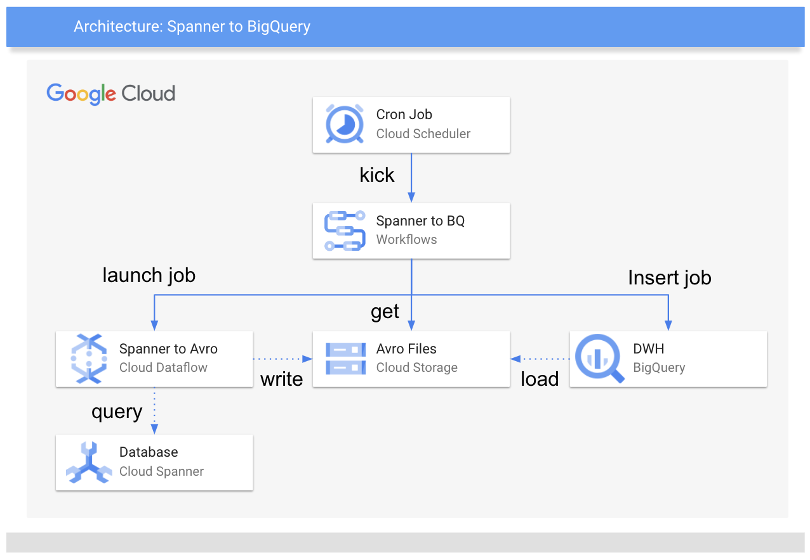

# Cloud SpannerのテーブルデータをBigQueryに定期的にコピーする

tag:["google-workflows", "google-bigquery", "google-cloud-spanner"]

## はじめに

データベースにCloud Spannerを採用しているプロジェクトでは、ユーザ利用分析や問題発生時の原因特定など、Cloud SpannerにあるデータをBigQueryにとりあえず全部持ってきていろいろ分析したいことも出てくるのではないでしょうか。
ただそのためには、一般的にSpannerからデータを取得する処理やデータをBigQueryにロードする処理を用意してApache Airflow等のワークフローエンジンで実行することになり、実行しようとするとやや腰が重いのではないかと思います。
そこでこのノウハウではフルマネージドなワークフローエンジンである[Workflows](https://cloud.google.com/workflows)を利用することで手軽に指定したSpannerのdatabaseの全テーブルをBigQueryに定期コピーする例を紹介します。



この例ではSpannerからのデータ取得にあたって、Googleが提供するDataflow Templateの一つである、[Cloud_Spanner_to_GCS_Avro](https://cloud.google.com/dataflow/docs/guides/templates/provided-batch#cloud_spanner_to_gcs_avro) を利用します。
このTemplateは指定したSpannerのdatabase配下の全テーブルのデータをテーブル別に区別されたAvroファイルとして保存することができます。
BigQueryではこのAvro形式のファイルのデータロードをサポートしているので、Workflowsを使ってこの公式Templateを起動してSpannerデータをAvroファイルとして出力し、テーブルごとにBigQueryにAvroファイルをロードするJobを実行するワークフローを作成しCloud Schedulerから定期実行します。

なお、この例ではGoogle公式Templateが以下の仕様を満たすことを前提とします。

* テーブルデータのAvroファイルは以下の命名規則により生成されるディレクトリ配下に出力される
  * `{指定したGCSパス}/{spannerInstanceID}-{spannerDatabaseID}-{dataflowJobID}/`
* 各テーブルのAvroファイルが上記ディレクトリ直下に以下命名規則により出力される
  * `{tableName}.avro-*`
* 全テーブル情報のリストを以下形式で含むファイルが上記ディレクトリ直下にspanner-export.jsonとして出力される
  * `{"tables": [{"name": tableName, ... }...]}`

## Workflowsファイル構成

Workflowsの設定は [spanner-to-bigquery.yaml](spanner-to-bigquery.yaml) の通りです。
steps項目で指定したstepが基本的には上から順に実行されます。
この例では以下のstepが順に実行されます。

* init: 定数を定義する
* launch_dataflow_job: Dataflow Templateを起動する
* wait_for_dataflow_job_done: Dataflow Jobが完了するのを待つ
* get_spanner_export: 出力されたspanner-export.jsonファイル情報を取得する
* download_spanner_export: ファイル情報から中身を取得する
* load_bigquery: 取得したテーブル一覧からテーブルごとにAvroファイルをロードする

以下個別にstepの中身を確認していきます。

### init: 定数を定義する

最初のstepでは以下の定数を定義しています。以降のstepの定義でこれら変数を参照することができます。

* 処理を実行するGCPプロジェクトID
* データ移動対象とするSpannerのInstanceID、DatabaseID、
* Avroファイルを保存するGCSのバケット
* Dataflowを起動するリージョン、Google提供のSpannerからGCSにAvroで保存するTemplateのパス
* BigQueryの保存先Dataset名、ロケーション

GCSのバケットはテーブルのロード実行にあたりBigQueryのデータセットと同じリージョンに設定する必要があるので注意ください。
なお、定数のかわりに実行時変数を定義してWorkflowを起動時に指定することもできます。

```yaml
    - init:
        assign:
            - PROJECT_ID: ${sys.get_env("GOOGLE_CLOUD_PROJECT_ID")}
            - SPANNER_INSTANCE: xxx
            - SPANNER_DATABASE: xxx
            - GCS_BUCKET_BACKUP: ${PROJECT_ID+"-spanner-backup"}
            - DATAFLOW_LOCATION: us-central1
            - DATAFLOW_TEMPLATE: gs://dataflow-templates/latest/Cloud_Spanner_to_GCS_Avro
            - BQ_DATASET: spanner_imports
            - BQ_LOCATION: US
```

### launch_dataflow_job: SpannerデータをAvroファイルとして保存するDataflow Jobを起動する

2番目となるstepではGoogle公式TemplateからDataflow Jobを起動します。
callではDataflow TemplateからDataflow Jobを起動する[Dataflow Template Launch API](https://cloud.google.com/workflows/docs/reference/googleapis/dataflow/v1b3/projects.locations.templates/launch)を指定しています。
Jobの起動条件を示すパラメータとして読み込むSpannerのGCPプロジェクトID、インスタンスID、データベースIDを指定しています。
またAvroファイルを出力するGCSのパスを指定しています。これらの値は先のstepで定義した定数から参照しています。
その他のパラメータとして`spannerPriority`や`shouldExportTimestampAsLogicalType`を指定しています。
`spannerPriority`はSpannerからのデータ取得にあたってクエリの優先度を設定するもので、Spannerインスタンスへの負荷の影響を極力小さくするためにLOWを指定しています。
`shouldExportTimestampAsLogicalType`は、このTemplateはデフォルトではTimestamp型を文字列として出力するため、これをBigQueryがTimestamp型と認識できるようにtrueに設定しています(trueは文字列として指定)

`result`にはcallで実行した結果が`launchResult`という変数に格納することを指示しており、次以降のstepでこの変数を参照することができます。
このcallではDataflow Jobの完了を待つことなくリクエストが完了します。Jobの完了を待つために後にこの変数を参照します。

```yaml
    - launch_dataflow_job:
        call: googleapis.dataflow.v1b3.projects.locations.templates.launch
        args:
            projectId: ${PROJECT_ID}
            location: ${DATAFLOW_LOCATION}
            gcsPath: ${DATAFLOW_TEMPLATE}
            body:
                jobName: spanner-backup
                parameters:
                    instanceId: ${SPANNER_INSTANCE}
                    databaseId: ${SPANNER_DATABASE}
                    spannerProjectId: ${PROJECT_ID}
                    outputDir: ${"gs://"+GCS_BUCKET_BACKUP+"/backup/"}
                    spannerPriority: LOW
                    shouldExportTimestampAsLogicalType: "true"
                    avroTempDirectory: ${"gs://"+GCS_BUCKET_BACKUP+"/temp/"}
            validateOnly: false
        result: launchResult
```

### wait_for_spanner_export: Dataflow Jobが完了するのを待つ

3番目となるstepでは前のstepで実行したSpannerからデータを抽出するDataflow Jobが完了するのを待ちます。
ここではdataflow Jobが完了する処理を[subworkflow](https://cloud.google.com/workflows/docs/reference/syntax/subworkflows)として`wait_for_dataflow_job_done`という名前で定義してそれを呼び出しています。
subworkflowである`wait_for_dataflow_job_done`の定義ではパラメータ`params`を定義して呼び出し元から変数を設定できるようにしています。
ここではJobの実行状況を確認するために必要なJobの`jobId`とJobを実行している`projectId`, `location`を指定しています。
`wait_for_dataflow_job_done`のstepsではsubworkflowの処理を定義しておりこちらも上から順次実行されます。
最初のstepではDataflowのJobの情報を取得する[Dataflow Job Get API](https://cloud.google.com/workflows/docs/reference/googleapis/dataflow/v1b3/projects.locations.jobs/get)を呼び出しており、先に定義した変数をここで指定、結果はjobResultという変数に代入しています。
次のstepではjobResultの中身を確認してJobが完了していたらsubworkflowを完了して処理を抜け出すよう定義しています。
Jobが終わっていなかった場合は次のstepに遷移します。
またJobの状態を確認する前にインターバルとして30秒待つ組み込み関数を実行しています。
30秒待ったあとは最初のstepである`get_dataflow_job`に遷移するよう定義します。

```yaml
    - wait_for_spanner_export:
        call: wait_for_dataflow_job_done
        args:
            jobId: ${launchResult.job.id}
            projectId: ${PROJECT_ID}
            location: ${DATAFLOW_LOCATION}

wait_for_dataflow_job_done:
    params: [jobId, location, projectId]
    steps:
        - get_dataflow_job:
            call: googleapis.dataflow.v1b3.projects.locations.jobs.get
            args:
                jobId: ${jobId}
                location: ${location}
                projectId: ${projectId}
            result: jobResult
        - check_dataflow_job_done:
            switch:
              - condition: ${jobResult.currentState=="JOB_STATE_DONE"}
                steps:
                  - done:
                      return: jobResult
        - wait_for_job_completion:
            call: sys.sleep
            args:
                seconds: 30
            next: get_dataflow_job
```


### get_spanner_export & download_spanner_export: Spannerのexportファイル情報を取得

4番目となるstepでは前のstepで完了したDataflow Jobにより出力されたSpannerのexportファイルを確認してAvroファイルや対応するテーブル名の情報を取得します。
Dataflow TemplateはSpannerのexport内容を記載したファイルを`{指定したGCSパス}/{spannerInstanceID}-{spannerDatabaseID}-{dataflowJobID}/spanner-export.json`に出力します。
このファイルを取得するためにまず[Cloud Storage Object Get API](https://cloud.google.com/workflows/docs/reference/googleapis/storage/v1/objects/get)でファイル内容を取得します。
ファイルのパスを先に定義した定数や取得したjobResultから組み立てて指定します(このobjectパラメータはURLエンコーディングする必要があるのに注意)。
このAPIはファイルの中身は含まないため、次の5番目のstepで取得したファイル情報からダウンロードリンクを取得してhttpリクエストで取得します。
その際にはworkflowsのサービスアカウントがファイルにアクセスできるようにauthでOAuth2を指定します。

```yaml
    - get_spanner_export:
        call: googleapis.storage.v1.objects.get
        args:
            bucket: ${GCS_BUCKET_BACKUP}
            object: ${"backup%2F"+SPANNER_INSTANCE+"-"+SPANNER_DATABASE+"-"+launchResult.job.id+"%2Fspanner-export.json"}
        result: spannerExport
    - download_spanner_export:
        call: http.request
        args:
            url: ${spannerExport.mediaLink}
            method: GET
            auth:
                type: OAuth2
        result: spannerExportJson
```

### load_bigquery: AvroファイルからBigQueryのテーブルにデータをロードする

6番目のstepでは前のstepで取得したAvroファイルや対応するテーブル名の情報を参照して各Avroファイルを対応するBigQueryのテーブルにロードしていきます。
各テーブルのロード処理は依存関係が無いため並行に実行可能なため、[parallel句](https://cloud.google.com/workflows/docs/reference/syntax/parallel-steps)を指定しています。
このparallel句配下のstepsで定義された処理が`in`句で指定した配列ごとに並行に実行されます。
`in`句で指定した配列の中身はvalue句で定義した変数に格納されます。
ロード処理の定義は先に取得したspanner-export.jsonファイルに記載の情報から組み立てます。
httpリクエストで取得したJSONファイルの内容はbodyフィールドにバイト列として格納されているため組み込み関数を使ってjsonとしてデコードします。
jsonのtables配列に抽出したSpannerのテーブル名が含まれているのでこれを利用してAvroファイルから同名のテーブルをBigQueryにロードします。
Spannerから出力したAvroファイルは`{指定したGCSパス}/{spannerInstanceID}-{spannerDatabaseID}-{dataflowJobID}/{tableName}.avro-xxxx`として保存されています。
そこで`load_bigquery_table`でこのtables配列のテーブル名から上記パスを組み立てて同名テーブルをロードするBigQueryのJobを実行する[BigQuery Job Insert API](https://cloud.google.com/workflows/docs/reference/googleapis/bigquery/v2/jobs/insert)を実行します。
テーブルロードのパラメータとしてテーブルの宛先やテーブルを上書きするかなどの設定を定義しています。
AvroのTimestampやDateなどの型をBigQueryで同じ型として取り込むために`useAvroLogicalTypes`でtrueを指定します。
次のstepではBigQueryのテーブルロードのJobが正常に完了するのを待ちます。
Dataflow Jobの完了を待ったのと同様にsubworkflowで`wait_for_bigquery_load_job_done`として定義してそれを呼び出しています。
ここでは20秒ごとにテーブルロードのJob内容を確認し、問題なく完了していると正常に終了します。
全てのテーブルロードのJobが完了すると、workflowは正常に処理を終了します。
(一つでもテーブルロードJobが失敗した場合はworkflow全体が失敗したとみなされます)

```yaml
    - load_bigquery:
        parallel:
            for:
                value: table
                in: ${json.decode(spannerExportJson.body).tables}
                steps:
                - load_bigquery_table:
                    call: googleapis.bigquery.v2.jobs.insert
                    args:
                        projectId: ${PROJECT_ID}
                        body:
                            configuration:
                                load:
                                    createDisposition: CREATE_IF_NEEDED
                                    writeDisposition: WRITE_TRUNCATE
                                    destinationTable:
                                        projectId: ${PROJECT_ID}
                                        datasetId: ${BQ_DATASET}
                                        tableId: ${table.name}
                                    sourceFormat: AVRO
                                    useAvroLogicalTypes: true
                                    sourceUris:
                                        - ${"gs://"+GCS_BUCKET_BACKUP+"/backup/"+SPANNER_INSTANCE+"-"+SPANNER_DATABASE+"-"+launchResult.job.id+"/"+table.name+".avro*"}
                    result: bigqueryLoadJob
                - wait_for_table_load:
                    call: wait_for_bigquery_load_job_done
                    args:
                        jobId: ${bigqueryLoadJob.jobReference.jobId}
                        projectId: ${PROJECT_ID}
                        table: ${table.name}
    - the_end:
        return: "SUCCESS"
wait_for_bigquery_load_job_done:
    params: [jobId, projectId, table]
    steps:
        - get_bigquery_job:
            call: googleapis.bigquery.v2.jobs.get
            args:
                jobId: ${jobId}
                location: ${BQ_LOCATION}
                projectId: ${projectId}
            result: jobResult
        - check_bigquery_job_done:
            switch:
              - condition: ${jobResult.status.state=="DONE" AND map.get(jobResult.status, "errors")==null}
                steps:
                  - succeeded:
                      return: jobResult
              - condition: ${jobResult.status.state=="DONE" AND map.get(jobResult.status, "errors")!=null}
                steps:
                  - failed:
                      raise: ${"Failed to load table "+table+" errorResult "+jobResult.status.errorResult.message}
        - wait_for_job_completion:
            call: sys.sleep
            args:
                seconds: 20
            next: get_bigquery_job
```

## スケジュール設定

ここで定義したYAML定義からコンソール画面やgcloudコマンド、APIからWorkflowを作成します。
workflowのtriggerとしてCloud SchedulerのJobを作成・連携することができ、ここで定義した処理内容を定期実行するよう簡単に設定できます。

## その他設定

Avroファイルの保存先GCS Bucketはデータ移動に伴う一時的なファイル置き場なので、ライフサイクル設定で一定時間経過したファイルを削除するようにするとコスト削減になり良いと思われます。
また今回の定義ではBigQueryのテーブルロードが一つでも失敗した場合はworkflow自体が失敗となりますが、失敗した理由が`backendError`だった場合は再実行すると正常終了することが多いので、リトライ設定など追加してもよいかもしれません。
SpannerからexportしたAvroファイルがすでにある状態からBigQueryへのテーブルロードだけを実行できるように実行時のパラメータでシーケンスを切り替え実行できると便利なケースもあるかもしれません。
このあたりはブラッシュアップしたら適宜更新します。

## おわりに

今回利用したWorkflowsは、タスクをPython等のプログラムで定義可能な既存のワークフローエンジンと比べて自由度は落ちるものの、フルマネージドで運用負担やコストが小さいため、ちょっとしたタスクに順序依存関係のあるワークフローを手軽に実行するのにとても便利だと思いました。
またWorkflowsではGCPサービスの操作は[組み込み関数として多数提供](https://cloud.google.com/workflows/docs/reference/googleapis)されており、サービスアカウントを利用した認証も連携しやすく、GCPのサービスに関するワークフローを実行するのに特に便利だと感じました。
Cloud Composerを使うにはオーバースペックに思えるようなシンプルなワークフローであればWorkflowsへの置き換えを検討しても良いかもしれません。
